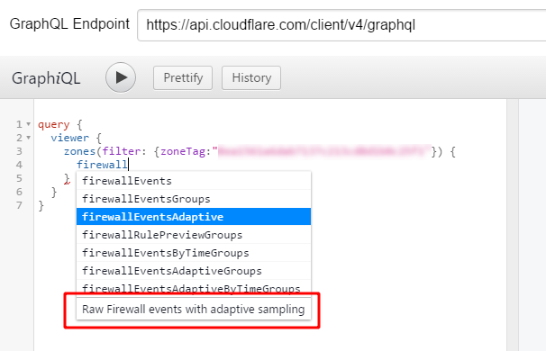
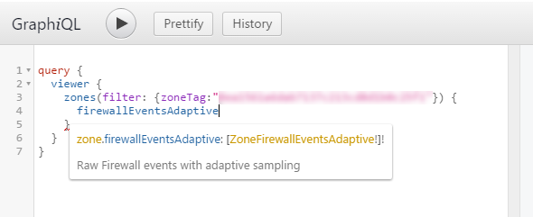
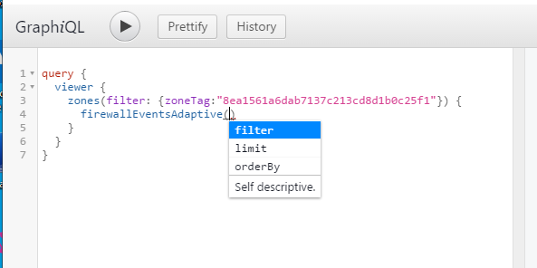
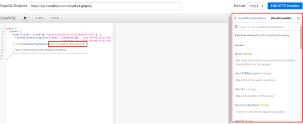

# Create a query in a GraphQL client

You can use a GraphQL client to build and execute queries to the GraphQL API endpoint. The example below uses the GraphiQL client.

Before you begin, configure the API endpoint and HTTP headers in the GraphQL client.

Click on the editing pane of GraphiQL and add the following base query:

```json
query {
  viewer {
    zones(filter: { zoneTag: "{zone-id}"}) {

    }
  }
}
```

To explore the documentation for the nodes and fields in the Cloudflare GraphQL schema, click **Docs** to open the _Documentation Explorer_ pane.

The GraphiQL client has auto completion, to assist query building. Place your cursor on the line under "zones" and start typing a word: a popup window appears, listing all the possible fields that contain that word. For example, if you type `firewall`, the popup displays the fields that return firewall information:



The text at the bottom of the list displays a short description of the data that the node returns.

Select the field you want to use and insert it into your query: either click the item in the list, or scroll using  arrow keys and hit return.

Hover your mouse over a field to open a popup window showing the documentation for that field. The following popup window appears when you hover over the `firewallEventsAdaptive` field:



Click on the node name (blue text) to display information about the field, including the required parameters, in the _Documentation Explorer_ pane.

Click on the type definition (gold text) to display information about the field type in the _Documentation Explorer_ pane.

Add the required parameters for the field in the editing pane: type the open parenthesis character, `(`, after the field name. GraphiQL inserts the closing parenthesis and opens a popup window with a list of required parameters:



Configure the required parameters.

To add the data fields that you want to display, type the opening bracket `{` after the closing parenthesis containing parameters. GraphiQL automatically inserts the closing bracket. For readability, hit the return key between the brackets.

Click the field type definition to display the list of fields in in the  _Documentation Explorer_ pane:



Start typing the name of a field that you want to fetch, to open an auto-complete list. Once you have entered all the fields you want, click the **Play** button to submit the query. The response pane contains the data fetched from the Cloudflare GraphQL API endpoint.

The GraphiQL client allows you to create variables to use in the query.
In the following example, the _Query variables_ pane contains a variable that represents a zone ID:

```json
{"zoneTag":"xxxxxxxxx"}
```

Use `$zoneTag` to refer to the variable in a query.


