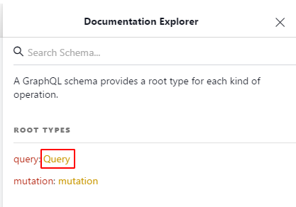
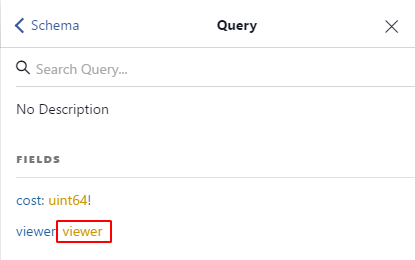
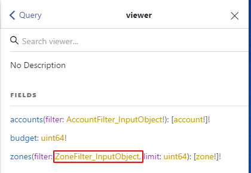
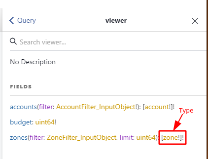
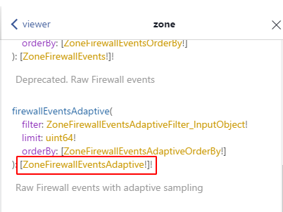
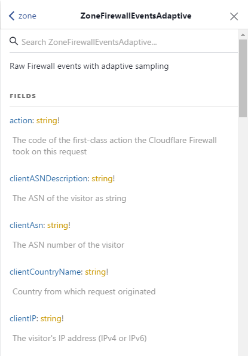

# Explore the GraphQL schema

One of the great features of a GraphQL API is that it offers "introspection"—you can explore the graph (by making API calls) to see the available data sets, the fields and their types, and the operations you can perform.

_GraphiQL_ uses this functionality to provide a "Documentation Explorer" that you can use to understand the schema. Click on the **Docs** link on the right-hand side and then drill down, starting with `query` and proceeding to `viewer` and then `zone`. GraphiQL also uses introspection to provide query auto-complete and syntax validation.

You can explore the schema of the Coudflare GraphQL endpoint in a GraphQL client. The examples below use the GraphiQL client.

Before you begin, configure the API endpoint and HTTP headers in the GraphQL client.

## Use the Documentation Explorer

Click **Docs** to open the **Documentation Explorer** pane.

A list of available nodes displays. The nodes in the list follow this syntax:

```
node-name: node-type-definition
```

## Find the type definition of a node

When you first open the **Documentation Explorer** pane, the **mutation** and `query` nodes display:



In this example `query` is the name of the node, and `Query` is the type definition of the node.

## Find the fields available for a given type definition

Click on the **type definition** of a node to view the fields that it provides. The **Documentation Explorer** pane also displays descriptions of the nodes.

Click the `Query` type definition. The **Documentation Explorer** panel displays the fields that the `query` node provides. In this example, the fields are `cost` and `viewer`.



## Find the arguments associated with a field

Click on the type definition of the `viewer` field to list its sub-fields. The `viewer` field provides sub-fields that allow you to query `accounts` or `zones` data:



The `accounts` and `zones` fields take arguments to specify which data set to query.

For the `zones` node you can provide a filter of `ZoneFilter_InputObject` type. To view the fields available to filter, click **ZoneFilter_InputObject**.

To limit the amount of search results that the query returns, click the **limit** argument.

## Find the search nodes available for a zone

To view a list of the search nodes available for a zone, click on the `zones` type definition after the colon (`:`) in the `zones` field:



A list of **search nodes** appears, with a brief description of their behavior and a list of valid arguments. Arguments that end with an exclamation mark (`!`) are required.



Refer to [Data Sets (tables)](/graphql-api/features/data-sets) for details on nomenclature and behavior of these nodes.

To view the fields that a node provides, click on its type definition. If you click on the **ZoneFirewallEventsAdaptive** type definition in the  **firewallEventsAdaptive** node, a list of fields is displayed:


