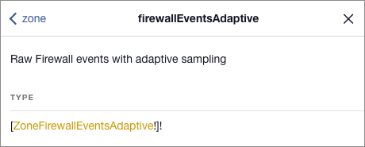

# Explore the Analytics schema with GraphiQL

The GraphQL API offers [introspection](https://graphql.org/learn/introspection/), which allows you to explore the graph (by making API calls) to see the available data sets, fields, and operations you can perform.

[GraphiQL](https://github.com/graphql/graphiql/tree/main/packages/graphiql#readme) is a GraphQL client that uses introspection to provide the **Documentation Explorer**, a tool with which you can visually browse a GraphQL schema.

This article provides an introduction to browsing the Analytics GraphQL schema with the Documentation Explorer.

## Prerequisites

Before you begin, [configure the API endpoint and HTTP headers](/graphql-api/getting-started/authentication/graphql-client-headers) in the GraphiQL client.

## Open the Documentation Explorer

To open the GraphiQL Documentation Explorer, click the **Docs** link in header of the response pane:


The **Documentation Explorer** opens and displays a list of available objects:


 Objects in the **Documentation Explorer** use this syntax:

```
object-name: object-type-definition
```

## Find the type definition of an object

When you first open the **Documentation Explorer** pane, the `mutation` and `query` root types display:


In this example `query` is the name of a root, and `Query` is the type definition.

## Find the fields available for a type definition

Click on the **type definition** of a node to view the fields that it provides. The **Documentation Explorer** also displays descriptions of the nodes.

For example, click the **Query** type definition. The **Documentation Explorer** displays the fields that `Query` provides. In this example, the fields are `cost` and `viewer`:


To explore the schema, click the names of objects and definitions. You can also use the search input (magnifying glass icon) and breadcrumb links in the header.

## Find the arguments associated with a field

Click the type definition of the `viewer` field (gold text) to list its sub-fields. The `viewer` field provides sub-fields that allow you to query `accounts` or `zones` data:


The `accounts` and `zones` fields take arguments to specify which data set to query.

For example, `zones` can take a filter of `ZoneFilter_InputObject` type as an argument. To view the fields available to filter, click **ZoneFilter_InputObject**.

## Find the data sets available for a zone

To view a list of the data sets available to query, click the **zone** type definition (gold text):


A list of data sets displays in the **Fields** section, each with list of valid arguments and a brief description. Arguments that end with an exclamation mark (`!`) are required.


Use the search input (magnifying glass icon) to find specific data sets:


To select a data set, click its name.

The definition for the data set displays. This example shows the `firewallEventsAdaptive` data set:


Refer to [_Data Sets (tables)_](/graphql-api/features/data-sets) for details on the nomenclature and behavior of these nodes.

## Find the fields available for a data set

To view the fields available for a particular data set, click on its type definition (gold text).

For example, click the **ZoneFirewallEventsAdaptive** type definition to view the fields available for the `firewallEventsAdaptive` data set:



The list of fields displays:


For more on working with the Analytics API in GraphiQL, see [Create a query in GraphiQL](/graphql-api/getting-started/compose-graphql-query).
