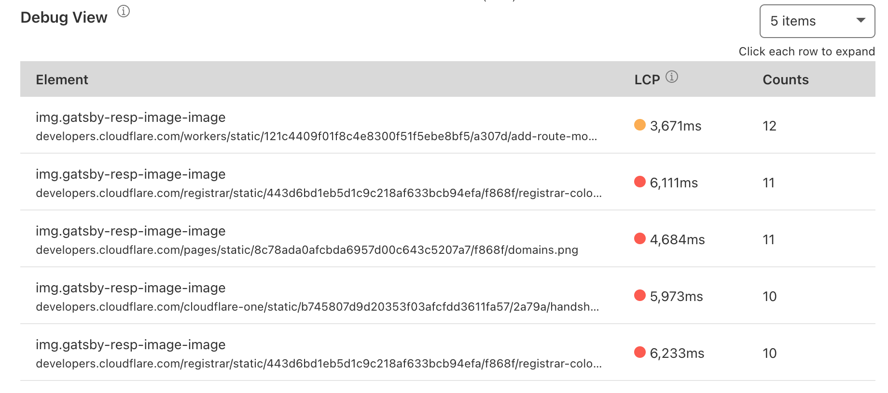

# Core Web Vitals

Core Web Vitals are higher-level metrics designed by Google to capture the user experience more completely. Three “core” Web Vitals metrics are measured: Largest Contentful Paint, First Input Delay, and Cumulative Layout Shift. 

Cloudflare Web Analytics offers more detail to the Core Web Vitals by allowing you to filter by Country, Host, Path, Referrer, Device Type, Browser, or Operating System in the Cloudflare dashboard. 

Each metric is assigned a rating of Good, Needs Improvement, or Poor based on [Google’s methodology and testing](https://web.dev/defining-core-web-vitals-thresholds/).

<Aside type="note"> 

Core Web Vitals is only supported in Chromium browsers, but Cloudflare plans to support Safari and Firefox as soon as possible.

</Aside> 

## Web Analytics Vitals Explorer

Vitals Explorer enables you to easily pinpoint which web page elements are affecting the user’s experience while browsing your website. Vitals Explorer is divided into three main sections, each one with information about a specific feature that affects user experience:

* [Largest Contentful Paint (LCP)](https://web.dev/optimize-lcp/). Measures perceived load speed by the user. It returns how long the main content of the page takes to be loaded.
* [First Input Delay (FID)](https://web.dev/optimize-fid/). Measures how fast a website is to respond to user input.
* [Cumulative Layout Shift (CLS)](https://web.dev/optimize-cls/). Measures visual stability, that is, if there are shifts in the page layout as the various elements are being loaded into view.

Below each graph there is the Debug View section with the top five elements with a negative impact on each metric. You can click on each of the elements shown in the data table to learn more details about it, such as path or the time it takes to be loaded. Each table — LCP, FID, and CLS — also shows you the performance of these elements in the 75th percentile (P75). After you click on each element on the table to expand it, you will also have access to P50, P90 and P99 metrics. 
These numbers refer to how the element performs relatively to the other elements in your page. For example, if an element takes 3,900 ms to load and it is in the 75 percentile, this means that this element in particular is slower to load than 75% of the elements in your page. 

## Information collected

Vitals Explorer needs to collect some information to work. It leverages a lightweight JavaScript beacon and does not use any client-side state, such as cookies or localStorage, to collect usage metrics. Vitals Explorer also does not “fingerprint” individuals via their IP address, User Agent string, or any other data.

### Common data collected for all Core Web Vitals

* **Element**. A CSS selector representing the DOM node. With this string, you can use `document.querySelector(<element_name>)` in the dev console of your browser to find out which DOM node has a negative impact on your scores/values.
* **Path**. The URL path at the time the Core Web Vitals are captured.
* **Value**. The metric value for each Core Web Vitals. This value is in milliseconds for LCP or FID, and a score for CLS (Cumulative Layout Shift).

### Data collected for Largest Contentful Paint

* **URL**. The source URL (such as image, text, web fonts).
* **Size**. The source object's size in bytes.

### Data collected for First Input Delay

* **Name**. The type of event captured (such as mousedown, keydown, pointerdown).

### Data collected for Cumulative Layout Shift

Layout information is a JSON value that includes width, height, x axis position, y axis position, left, right, top, and bottom. These values represent the layout shifts that happen on the page.

* **CurrentRect**. Captures the layout information of the DOM element with the largest area, after the shift in the page has occurred. This JSON value is shown as **Current** under the **Layout Shifts** section, below the graph in **Cumulative Layout Shift** > **Debug View**. Clicking on any element in that table will give you access to this information.

* **PreviousRect**. Captures the layout information of the DOM element with the largest area, before the shift in the page has occurred. This JSON value is shown as **Previous** under **Layout Shifts** section, below the graph in **Cumulative Layout Shift** > **Debug View**. Clicking on any element in that table will give you access to this information.
