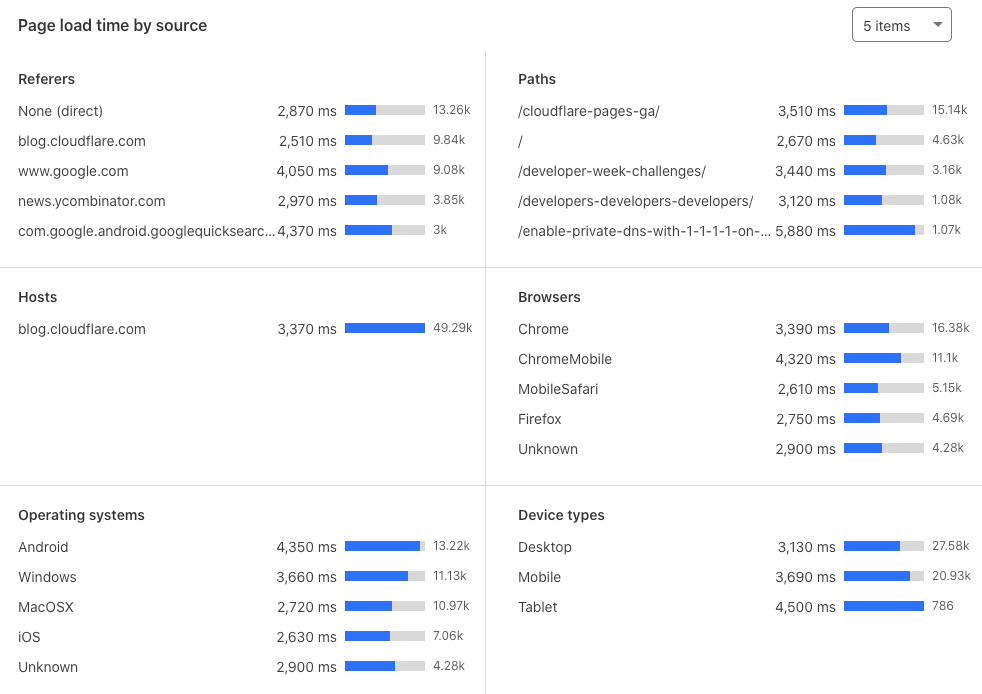

# Dimensions

Break down and filter Web Analytics by various dimensions.

* Referers - The external links referring visits to a page.
* Paths - The links within your site referring visits to a page.
* Hosts - The domain of the site's URL.
* Browsers - The web browsers visitors use to access a page.
* Operating Systems - The operating system visitors use to access a page.
* Device Types - The device visitors use to access a page (for example, desktop, mobile, or tablet).

