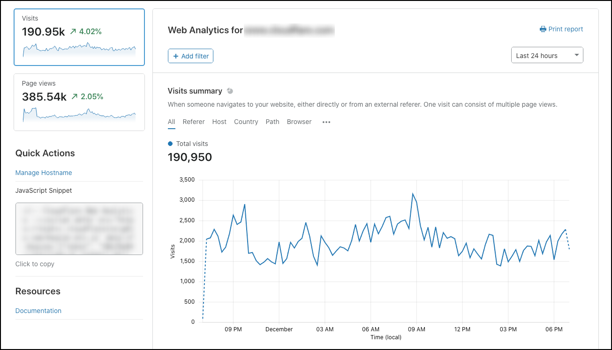

# Understanding Cloudflare Web Analytics

View your website’s page views, visits, page load time, and Core Web Vitals by switching between views on the graph.

<ul>
<li>Visits - A a page view that originated from a different website or direct link. Cloudflare checks where the HTTP referer does not match the hostname. One visit can consist of multiple page views.
</li>
<li>Page views - A successful HTTP response with a content-type of HTML.</li>
<li>Page load time - The total amount of time required to load the page.</li>
<li>Core Web Vitals - Higher-level metrics designed by Google to capture the user experience more completely. </li>
</ul>

