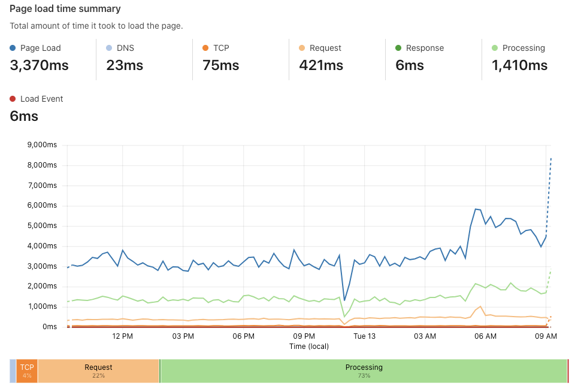

# Page Load Time Summary

<ul>
<li><li>Page load - The total amount of time required to load the page.</li></li>
<li>DNS (domainLookupEnd - domainLookupStart) - How long a DNS query takes. This could appear as zero for re-used connections or content stored in the local cache (memory or disk).</li>
<li>TCP (connectEnd - connectStart) - How long it takes to establish a TCP connection with the server. If using HTTPs, this process includes TLS negotiation time.</li>
<li>Request (responseStart - requestStart) - The time elapsed between making an HTTP request and receiving the first byte of the response.</li>
<li>Response (responseEnd - responseStart) - The time elapsed between the first byte and the last byte of the received response. Think of this as a resource download time.</li>
<li>Processing (domComplete - domInteractive) - How long it took to render the page. This includes loading any resources that block page rendering, including images, scripts, and style sheets. If this number is big, optimize your document architecture, resource size, or configure settings in the Cloudflare Speed app, such as Auto Minify the source code. This document process can be drilled down more with domInteractive, domContentLoadedEventStart, domContentLoadedEventEnd, and domComplete.</li></ul>

