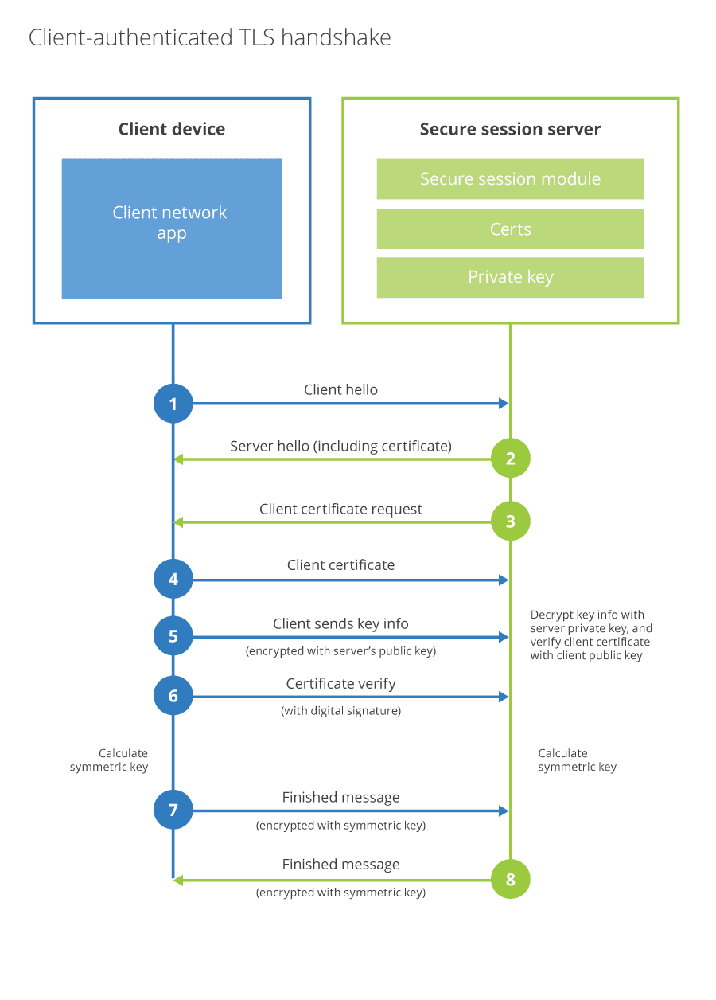

# Mutual TLS (mTLS)

Mutual TLS (mTLS) authentication uses client certificates to ensure traffic between client and server is bidirectionally secure and trusted. mTLS also allows requests that do not authenticate via an identity provider, such as Internet-of-things (IoT) devices, to demonstrate they can reach a given resource.

Support includes [gRPC](https://grpc.io/docs/what-is-grpc/introduction/)-based APIs, which use binary formats such as protocol buffers rather than JSON.

When you specify the API hosts, Cloudflare will block all requests that do not have a certificate for mutual TLS (mTLS) authentication.

<Aside type='note'>

Mutual TLS using a Cloudflare-managed certificate authority (CA) is available to all Cloudflare plans.

</Aside>

## Configuring mTLS

To protect your application with mTLS authentication, use this workflow:

1. Use Cloudflare's fully hosted public key infrastructure (PKI) to [create a client certificate in the Cloudflare dashboard](https://developers.cloudflare.com/ssl/client-certificates/create-a-client-certificate).

1. [Configure your mobile app or IoT device](https://developers.cloudflare.com/ssl/client-certificates/configure-your-mobile-app-or-iot-device) to use your Cloudflare-issued client certificate.

1. [Enable mTLS](https://developers.cloudflare.com/ssl/client-certificates/enable-mtls) for the hosts you wish to protect.

1. Create Cloudflare Firewall Rules that [require API requests to present a valid client certificate](https://developers.cloudflare.com/firewall/recipes/require-valid-client-certificate). The **Firewall** app in the Cloudflare dashboard provides a dedicated interface where you can [create mTLS rules](https://developers.cloudflare.com/firewall/cf-dashboard/create-mtls-rule).

<Aside type='warning' header='Important'>

API Shield's Mutual TLS requires Cloudflare-issued certificates. You can use mTLS with any fully managed certificate authority (CA) where Cloudflare issues the client certificates.

If you need to use certificates issued by another CA, use <a href="https://developers.cloudflare.com/cloudflare-one/identity/devices/mutual-tls-authentication?">Cloudflare Access</a> to upload your own CA.

When using Yubikeys, the browser may prompt for unlocking the key due to a problem in Yubikey's PKCS#11 library.

</Aside>