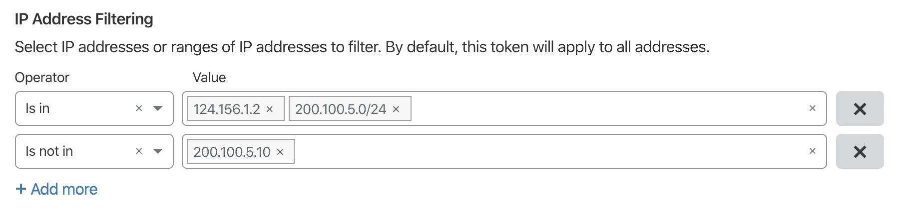
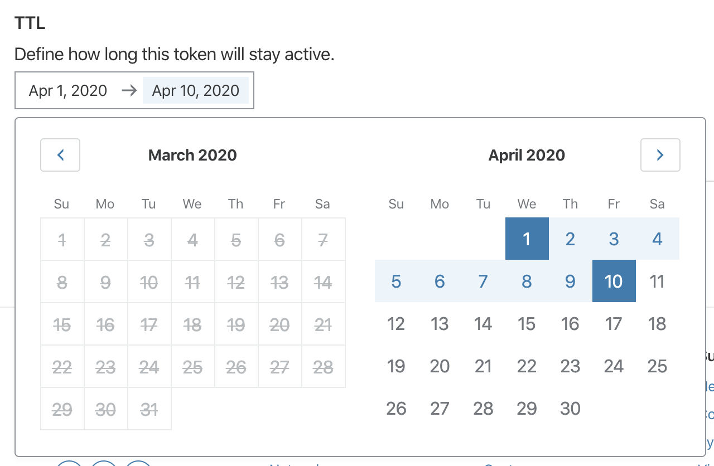

# Restricting token use

API Tokens can be restricted at runtime in two ways:

1. [IP Address Range Filtering](#ip-address-range-filtering)
2. [Time To Live (TTL) constraints](#time-to-live)

## IP address range filtering

IP Restrictions control which IP address API requests with this token can and cannot be made from. By default, if no filtering is applied the the token can be used from all addresses. Once an `Is in` rule is applied the token can only be used from the IPs defined. Ranges can be defined with [CIDR notation](https://en.wikipedia.org/wiki/Classless_Inter-Domain_Routing#CIDR_notation). If allowing an IP range with exceptions is required then a `Is not in` can be defined to exempt specific IPs or smaller ranges.

## Time to live

By default, tokens don't expire. They are long lived. Defining a TTL allows for setting when a token starts being valid and when a token is no longer valid. This is often referred to as `notBefore` and `notAfter`. Setting these timestamps will limit the lifetime of the token to the defined period. Not setting the start date or `notBefore` means the token is active as soon as it is created. Not setting the end date or `notAfter` means the token does not expire.

Note: Dates selected are defined as 00:00 UTC of that day. For finer grained time selection, please use the [API](./api).

