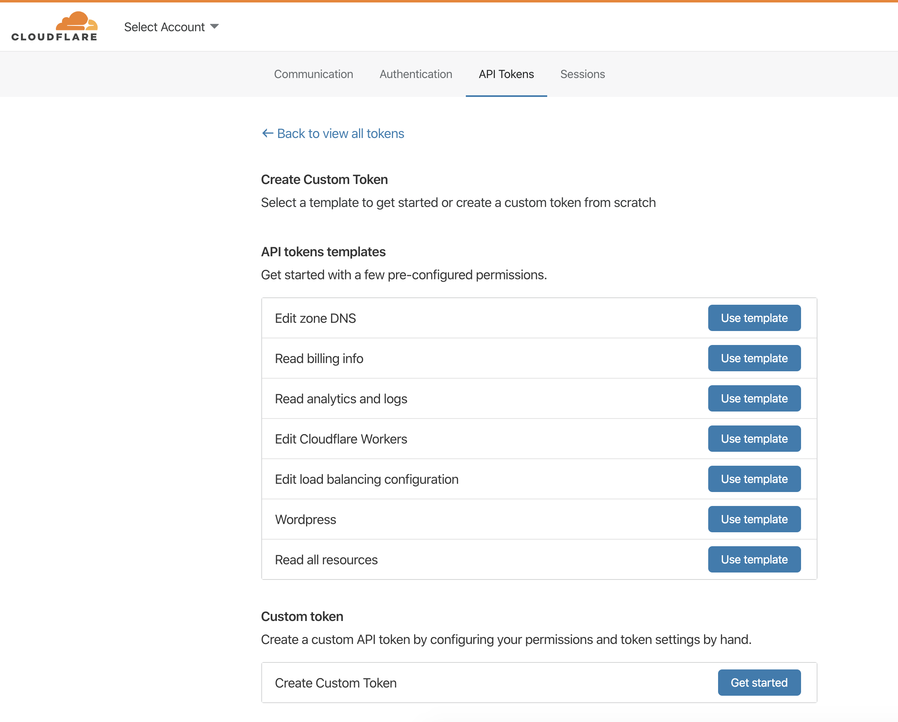
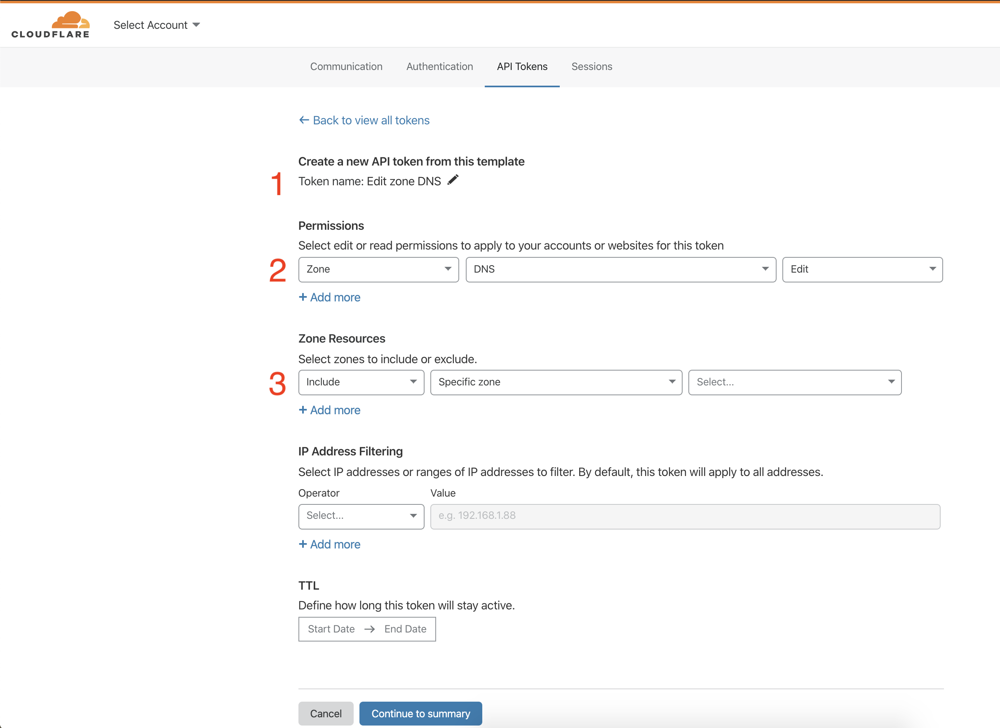
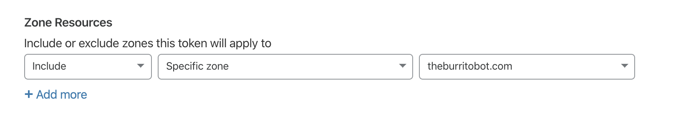
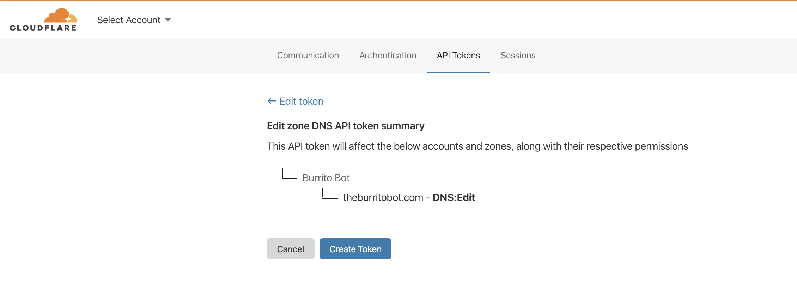
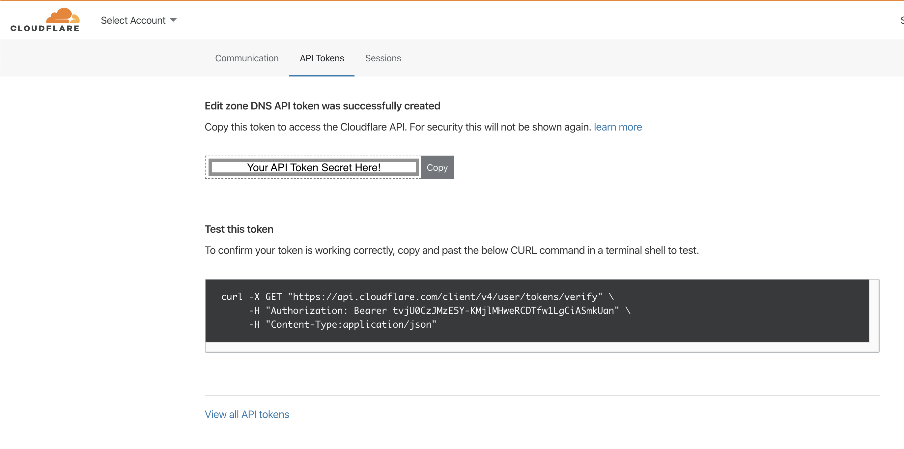

# Creating API tokens

## Getting Started

To get started creating an API Token, log into the [Cloudflare Dashboard](https://dash.cloudflare.com) and go to `User Profile` -> `API Tokens` or simply [click here](https://dash.cloudflare.com/profile/api-tokens). From the API Token home screen select `Create Token`.

If you are new to API Tokens or the Cloudflare API, Templates are the quickest way to get started. If you think a specific template matches your needs, go ahead and select it. You will be able to further customize the template after selecting it. If no template matches your use case or you want to build the token from scratch, select `Create Custom Token`



## Customizing the Token

For this example, the `Edit Zone DNS` template has been selected. After selecting, you are presented with a view of the currently selected permissions. There are 3 required inputs to creating a Token:

1. The token name
2. The permissions granted to the token
3. The resources the token can affect

There are two additional inputs that can be used to restrict how a token is used. These are *IP restrictions* and *Time to Live (TTL) restrictions*. Both of these are covered in Advance Usage under [Restricting Token Use](/tokens/advanced/restrictions)



Because a template was selected, both the name and the permissions have been pre-selected. In the case of a custom token, both of inputs one and two would need to be filled in. the only required selection is which zones the token should belong to. Let's cover each of these sections.

### Token Name

This can be anything text and should be informative of why or how the token is being used as a reference.

### Token Permissions

Permissions are segmented into three categories based on resource:

1. Zone Permissions
2. Account Permissions
3. User Permissions

Each category contains Permission Groups related to those resources. DNS permissions belong to the Zone category, while Billing permissions belong to the Account category. A full list of the Permission Groups can be [found here](/tokens/create/permissions)

After selecting a Permission Group, you can choose what level of access to grant the token. Most groups offer `Edit` or `Read` options. `Edit` is full _CRUDL_ (_create_, _read_, _update_, _delete_, _list_) access, while `Read` is just the _read_ permission and _list_ where appropriate.

### Token Resources

The resources selected will be the only ones that the token will be able to perform the authorized actions against. For example granting `Zone DNS Read` access to a zone `example.com` will allow the token to read DNS records for only that specific zone. Any other zone will return an error for DNS record reads operations. Any other operation on that zone will also return an error.

As permissions are selected in resource categories, options for selecting the appropriate resources will appear. Note that for user permissions, there is no necessary selection as the token will operate on the user creating the token.

#### Zone Resources

When creating tokens with access to zone resources there are multiple ways to define the access. The options available are:

1. A specific zone - ex: example.com.
2. All zones from a specific account - ex: All zones belonging to the account named `example production`.
3. All zones in all accounts. This grants access to every zone you have access to. Exercise caution when granting permissions this widely.

Note: When selections of option 2 or 3 are included, then excluding zones can be used to "allow all" zones as defined except specific zones.

For this example, we go with option 1 and select the zone `theburritobot.com`.



#### Account Resources

Account resources are similar to zone resources but with 1 less option:

1. A specific account - ex: My Production Account.
2. All accounts. This would be all the accounts the user has access to.

Once you have selected the appropriate permissions and resources, select `Continue to Summary` to review the token before creating.

## Verifying Your Selection

The token summary screen allows you to see all the resources and permissions the token will have before creating the token and seeing the token's secret.



If there are any issues you can go back and make adjustments. Even if after creating and using the token modifications need to be made, a token can be edited after creation.

Once you have verified the token is as desired, select `Create Token` to proceed to generating the Token's secret.

## Generating the Token

Once successfully generated, the token secret is only shown once. Make sure to copy the secret to a secure place.

*Warning:* Do not store the secret in plaintext where others may be able to access it. Anyone with this token can perform the authorized actions against the resources the token has been granted access to.



This screen also includes an example command to test the token (reproduced below). The `/user/tokens/verify` endpoint allows fetching the current status of the given token.

```bash
 curl -X GET "https://api.cloudflare.com/client/v4/user/tokens/verify" \
     -H "Authorization: Bearer <token secret>" \
     -H "Content-Type:application/json"
```

The result:

```json
{
  "result": {
    "id": "100bf38cc8393103870917dd535e0628",
    "status": "active"
  },
  "success": true,
  "errors": [],
  "messages": [
    {
      "code": 10000,
      "message": "This API Token is valid and active",
      "type": null
    }
  ]
}
```

With this you have successfully created an API Token and can now start working with the Cloudflare API!

## Roll API token

If the secret is lost or believed to be compromised, you can either create a new token or your token can be rolled to generate a new secret. Rolling your secret key into a new one will invalidate the previous secret, but the access and permissions will be the same as the previous key.

To roll your API token:
1. Log into your [Cloudflare account](https://dash.cloudflare.com) and go to **User Profile** > **API Tokens**.
1. Next to the API token you wish to roll, click the **three dot icon** > **Roll**.
1. Then, click **Confirm** to continue and you will see a new API token secret key.