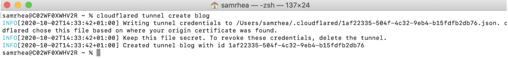
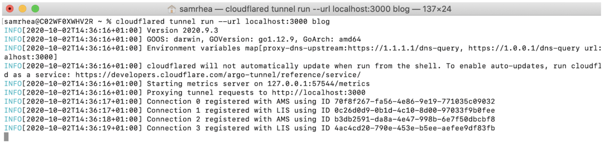
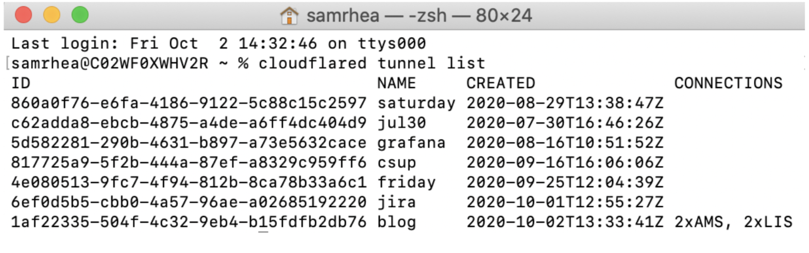

# Create and run a Tunnel

| Before you start |
|---|
| 1. [Add a website to Cloudflare](https://support.cloudflare.com/hc/en-us/articles/201720164-Creating-a-Cloudflare-account-and-adding-a-website) |
| 2. [Change your domain nameservers to Cloudflare](https://support.cloudflare.com/hc/en-us/articles/205195708) |
| 3. [Enable Argo Smart Routing for your account](https://support.cloudflare.com/hc/articles/115000224552-Configuring-Argo-through-the-UI)  |
| 4. [Install `cloudflared` and authenticate the software](/getting-started) |

## Create a Tunnel

Run the following command to create a Tunnel.

 `cloudflared tunnel create <NAME>`

Replace `<NAME>` with the name you want to give to the Tunnel. The name assigned can be any string and does not need to relate to the hostname where traffic will be served.

This command will create a Tunnel with the name provided and associate it with a UUID. The relationship between the UUID and the name is persistent. The command will not create a connection at this point.

Creating a Tunnel generates a credentials file for that specific Tunnel. This file is distinct from the cert.pem file. To run the Tunnel without managing DNS from `cloudflared`, you only need the credentials file.

<TableWrap>

| Action | `cert.pem` | Credentials file |
|---|---|---|
| Create a new Tunnel | Required | - |
| Delete a Tunnel | Required | - |
| Run a Tunnel | Available | Required |
| Create DNS records from `cloudflared` | Required | - |
| Connect to load balancer pools from `cloudflared` | Required | - |
| Route traffic to a running Tunnel from the Cloudflare dashboard | Available | Available |

</TableWrap>

## Run a Tunnel

Once created, you can run the Argo Tunnel to proxy incoming traffic from the Tunnel to any number of services running locally on your origin. To begin, run the Tunnel with the following command.

`cloudflared tunnel --config path/config.yaml run <NAME>`

If you have deleted the `cert.pem` file, you must specify the UUID instead of the name.

`cloudflared tunnel --config path/config.yaml run <UUID>`

You can also specify the Tunnel name or UUID inside of the configuration file, in which case the command below will invoke the `run` command for that Tunnel.

`cloudflared tunnel --config path/config.yaml run`

If you do not specify a configuration file location, `cloudflared` will attempt to read a configuration file in `~/.cloudflared/config.yml`.

When `cloudflared` receives a HTTP request from the internet it matches the incoming request to an ingress rule from the config file. The ingress rules specify which traffic should go to which local services. See the section on [Ingress Rules](/routing-to-tunnel/ingress).

You can also run the Tunnel without a configuration file by appending the flags after the `run` command and before the name or UUID. Running your tunnel this way will route _all_ traffic to the given URL.

`cloudflared tunnel run --url localhost:3000 <NAME or UUID>`

Once run, this command will establish an outbound-only connection to Cloudflare’s edge. That connection will not yet serve traffic. Any requests made to the Tunnel directly will fail. To route traffic from a hostname or load balancer pool, follow the routing instructions.

You can also:
* [Run a tunnel as a Kubernetes sidecar](/create-tunnel/kubernetes-sidecar-model/)
* [Run a tunnel as a service](/create-tunnel/run-as-service)

## List available Tunnels

`cloudflared` can list all created Tunnels in your account, as well as those actively connected to Cloudflare, by running the following command:

`cloudflared tunnel list`

Note: the command requires the `cert.pem` file.

