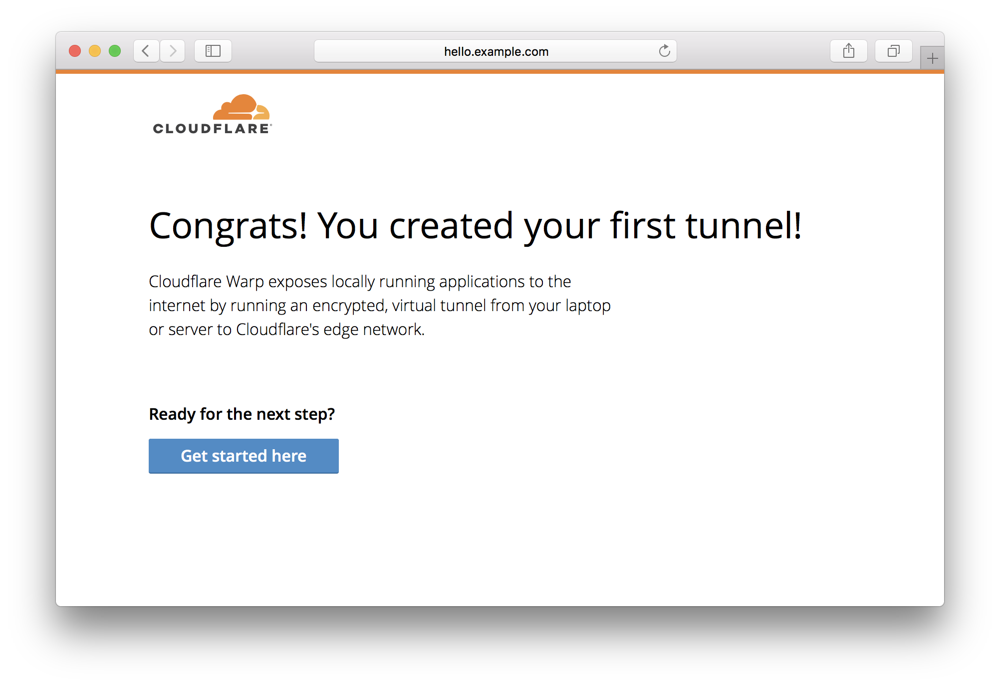

# Quickstart

<Aside type='warning' header='⚠️ THIS PAGE IS OUTDATED'>

We're no longer maintaining this page. **It will be deleted on Feb 8, 2021**. Please visit the new [Cloudflare for Teams documentation](https://developers.cloudflare.com/cloudflare-one/teams-docs-changes) instead.

</Aside>

Argo Tunnel offers an easy way to expose web servers securely to the internet, without opening up firewall ports and configuring ACLs. Argo Tunnel also ensures requests route through Cloudflare before reaching the web server, so you can be sure attack traffic is stopped with Cloudflare’s WAF and Unmetered DDoS mitigation, and authenticated with Access if you've enabled those features for your account.

Argo Tunnel relies on the `cloudflared` daemon to create a persistent connection between your web server and the Cloudflare network. You can lock down the web server to external requests. Instead, Argo Tunnel will connect out to Cloudflare from your origin.

## How much does Argo Tunnel cost?
Argo Tunnel is free with the purchase of Argo Smart Routing. Argo Smart Routing can be purchased [in the Cloudflare dashboard](https://dash.cloudflare.com/?zone=traffic) and costs $5/month plus 10 cents per GB. Cloudflare only charges for Argo routing; there is no charge for the count of tunnels used.

## Setup

### Requirements
* A <a href="http://dash.cloudflare.com/" target="_blank">Cloudflare account</a>
* The [`cloudflared`](/downloads/) daemon
* An <a href="https://support.cloudflare.com/hc/en-us/articles/201720164-Step-2-Create-a-Cloudflare-account-and-add-a-website">active zone on Cloudflare</a>
* An active subscription to <a href="https://dash.cloudflare.com/?zone=traffic">Argo</a> which you can enable in the Cloudflare dashboard in the Traffic tab

### Step 1: Enable Argo
Argo Tunnel uses Argo Smart Routing technology to route traffic over the fastest path within the Cloudflare network between the user and the data centers closest to your origin.

To begin using Argo Smart Routing, navigate to the <a href="https://dash.cloudflare.com/?zone=traffic" target="_blank">Traffic tab of the Cloudflare dashboard</a>, click the 'Enable' button, and follow the steps on the screen for setting up usage-based billing.

<Aside>

Enterprise customers who have enabled Argo will need to contact their Cloudflare representative to have Argo Smart Routing enabled for their account.
</Aside>

### Step 2: Install cloudflared
`cloudflared` is the software that runs Argo Tunnel. `cloudflared` is available for amd64, x86, and ARMv6 machines in Binary, .deb, and .rpm types. The code for the `cloudflared` client is available on GitHub [here](https://github.com/cloudflare/cloudflared).

[Follow these instructions to install `cloudflared`](/downloads/)

Once installed, verify `cloudflared` has installed properly by checking the version.

```sh
$ cloudflared --version
cloudflared version 2019.2.1 (built 2019-02-28-0010 UTC)
```

Not working? If you installed a .deb or .rpm package (Linux) or used Homebrew (macOS) it should be in your `PATH`; otherwise, change to the directory where you extracted `cloudflared`.

### Step 3: Login to your Cloudflare account
Next, login to your Cloudflare account from `cloudflared`. You will use the same username and password that you use to login to the Cloudflare dashboard.

Run the following command and a login page should open in your browser:

```sh
$ cloudflared tunnel login
A browser window should have opened at the following URL:

https://dash.cloudflare.com/argotunnel?callback=https%3A%2F%2Flogin.cloudflarewarp.com%2FA5XXPKA6S5N5YWMTOXRKVWPRPE7BHG3MFRCDZES7UBZU7SWQFF4KA4PWMGL5GXJ
```

_If the browser fails to open automatically, copy and paste the URL into your browser's address bar and press enter._

Once you login, you will see a list of domains associated with your account. Argo Tunnel connects your machine to the Cloudflare network by associating it with a hostname in your Cloudflare account. Locate the domain you wish to use to represent your server and select its name in the table. Once you select the domain, `cloudflared` will automatically install a certificate to authenticate your machine to the Cloudflare network for the specific hostname. Once `cloudflared` installs the certificate, you'll see a "Success" message in your browser, and you can start using `cloudflared` and Argo Tunnel.

<Aside>

The certificate consists of three components bundled into a single PEM file. One of those components consists of the API key from the user who authenticated. If this user leaves the Cloudflare account or their permissions change, that API key will be invalidated and the tunnel will fail to authenticate. A new certificate will need to be generated.
</Aside>

Sometimes firewalls or unusual network configuration can prevent `cloudflared` from automatically installing the certificate. If this occurs, your browser will download the certificate as a file named `cert.pem`. You should see it in your browser's standard list of downloaded files. You'll need to move that `cert.pem` file from your browser's downloads folder into the `~/.cloudflared` folder. Copy and paste the following command to move the certificate to the `.cloudflared` directory on your system.

```sh
$ mv cert.pem ~/.cloudflared/cert.pem
```

### Step 4: (Optional) Hello Tunnel
Argo Tunnel runs a virtual, encrypted tunnel from a local web server to the Cloudflare network. If you do not have a web server running locally and want to test Tunnel, you can try a hello world installation with the built-in web server.

To do so, pass the flag --hello-world and replace [hostname] with a hostname in your Cloudflare account. Because Tunnel automatically creates DNS records for you, you can choose a subdomain that is not otherwise in use.

```sh
$ cloudflared --hostname [hostname] --hello-world
INFO[0000] Build info: {GoOS:darwin GoVersion:go1.11.1 GoArch:amd64}
INFO[0000] Version 2019.2.1
INFO[0000] Flags map[hostname:test.warptunnels.org no-autoupdate:true grace-period:10s hello-world:true]
INFO[0000] cloudflared will not automatically update when run from the shell. To enable auto-updates, run cloudflared as a service: https://developers.cloudflare.com/argo-tunnel/reference/service/
INFO[0000] Starting metrics server                       addr="127.0.0.1:51245"
INFO[0000] Starting Hello World server at 127.0.0.1:51246
INFO[0000] Proxying tunnel requests to https://127.0.0.1:51246
INFO[0009] Connected to LAX
INFO[0009] Each HA connection's tunnel IDs: map[0:n1ud0l8y47d5755vsqxuvaa3tf7rp4dp643a6r3vvlffz9ek4gi0]
INFO[0009] Route propagating, it may take up to 1 minute for your new route to become functional
INFO[0020] Connected to SFO-DOG
INFO[0020] Connected to LAX
INFO[0020] Each HA connection's tunnel IDs: map[0:n1ud0l8y47d5755vsqxuvaa3tf7rp4dp643a6r3vvlffz9ek4gi0 1:n1ud0l8y47d5755vsqxuvaa3tf7rp4dp643a6r3vvlffz9ek4gi0]
INFO[0020] Route propagating, it may take up to 1 minute for your new route to become functional
INFO[0020] Each HA connection's tunnel IDs: map[0:n1ud0l8y47d5755vsqxuvaa3tf7rp4dp643a6r3vvlffz9ek4gi0 1:n1ud0l8y47d5755vsqxuvaa3tf7rp4dp643a6r3vvlffz9ek4gi0 2:n1ud0l8y47d5755vsqxuvaa3tf7rp4dp643a6r3vvlffz9ek4gi0]
INFO[0020] Route propagating, it may take up to 1 minute for your new route to become functional
INFO[0020] Connected to SFO-DOG
INFO[0020] Each HA connection's tunnel IDs: map[3:n1ud0l8y47d5755vsqxuvaa3tf7rp4dp643a6r3vvlffz9ek4gi0 0:n1ud0l8y47d5755vsqxuvaa3tf7rp4dp643a6r...
```

Above, you can see Tunnel establishes four long-lived connections between the two closest data centers. You know the tunnel is ready when you see the message `Connected to …`.

When the messages above conclude, Argo Tunnel has successfully created a connection out from your machine to the Cloudflare network.

If you go visit the domain name at which you created the tunnel (e.g. tunnel.example.com) you will see the request logs directly in the `cloudflared` output with debug level enabled. We call this Tunnel Vision.

```txt
INFO[0615] GET https://127.0.0.1:62627/ HTTP/1.1         CF-RAY=4067701b598e8184-LAX
INFO[0615] 200 OK                                        CF-RAY=4067701b598e8184-LAX
```

### Step 5: Establishing the tunnel
With your credentials saved to disk, you can now start Argo Tunnel for your production service. Replace [hostname] with the hostname you want associated with your server; this must be the domain or subdomain of a zone added to your Cloudflare account.

The localhost address should point to a locally running web server.

```sh
$ cloudflared tunnel --hostname [hostname] --url http://localhost:8000
INFO[0000] Proxying tunnel requests to https://127.0.0.1:8000
INFO[0000] Starting metrics server                       addr="127.0.0.1:62634"
INFO[0001] Connected to LAX
INFO[0020] Connected to LAX
INFO[0019] Connected to SFO
INFO[0021] Connected to SFO
```

A successful connection gives you the last line `Connected to…`

If you get the error: ‘Server error: Fail to update CNAME’ it is because there is already a DNS A/AAAA record existing at that hostname. You should either first delete the existing A/AAAA records or create a tunnel on a brand new hostname.

### Step 6: Test the configuration
Open a web browser and type in the selected hostname. Access to the Tunnel is permitted over both HTTP and HTTPS, though you can easily redirect all HTTP traffic to HTTPS with Cloudflare.

If the connection succeeds, you should see content served from your local webserver. If you used the built-in Hello World server, you will see a message like this:


### Next steps
The steps above can be sufficient for local dev environments. For a production environment, we recommend a few additional settings be configured:

* [Automatically starting Argo Tunnel](/reference/service)
* [Configuration file format](/reference/config)
