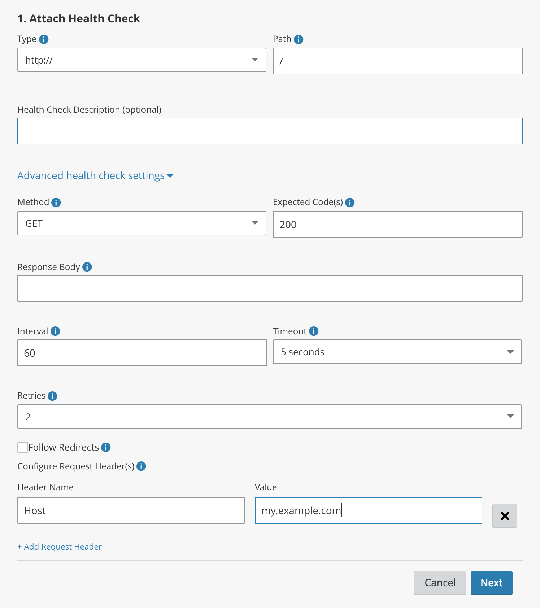

# Load balancing

<Aside type='warning' header='⚠️ THIS PAGE IS OUTDATED'>

We're no longer maintaining this page. **It will be deleted on Feb 8, 2021**. Please visit the new [Cloudflare for Teams documentation](https://developers.cloudflare.com/cloudflare-one/teams-docs-changes) instead.

</Aside>

You can create a load balancer within Cloudflare which will direct traffic to
Argo Tunnels which have been started on multiple machines or even on multiple continents.
This is the recommended way to deploy high-availability tunnels in production, and allows
you to use all of the powerful features provided by [Cloudflare Load Balancing](https://www.cloudflare.com/load-balancing/).

The first step is to ensure you have load balancing enabled in your Cloudflare account. Visit
the Traffic tab of the Cloudflare Dashboard and click "Enable Load Balancing". Each instance of `cloudflared`
is counted as one origin.

Next, start your tunnel with the `--lb-pool` flag:

```sh
$ cloudflared tunnel --hostname my.example.com --url http://localhost:8080 --lb-pool my-pool-name-goes-here
```

You can name your pool anything you like, we will automatically create it for you if it does not exist.
This example will connect the local port 8080 to your new load balancer, and connect that load
balancer to my.example.com.

<Aside>

A single load balancer pool can contain either Argo Tunnel origins, or non-Argo Tunnel origins, but not both. Mixed pools are not supported.
</Aside>

All pools will be created inside a load balancer identified by the hostname specified for your Argo Tunnels.
You can have a single pool in your load balancer, or create multiple pools to build more complex topologies.

Each Argo Tunnel is composed of multiple connections which each get load balanced individually. You will see 4 origins
in your load balancer configuration, but you will only be billed for one origin per Argo Tunnel.

You'll generally want to add a health check which will periodically check your application through
your tunnel. You can configure a health check through the load balancing API or UI. The one note is
you should manually specify your Tunnel's hostname as the Host header:



## Fall-back pools
Users can configure fall-back pools in the event that service through an active tunnel is disrupted. The fall-back pool will consist of origin servers that can be reached over IP networks using TLS encryption and by making sure that the [Cloudflare IP addresses](https://www.cloudflare.com/ips/) are allowed (whitelisted) to reach to origin servers in this fall-back pool.

The failover threshold from Argo Tunnel pool (number of healthy servers in the pool, number of [health-check failures](https://support.cloudflare.com/hc/en-us/articles/230866667-Identifying-Load-Balancing-Health-Checks), etc.), can be configured accordingly. In events that a fail-over to the fall-back pool may happen, the primary pool (Argo Tunnel) will become active again as soon as the configured threshold for number of healthy servers and state of health-checks is restored.