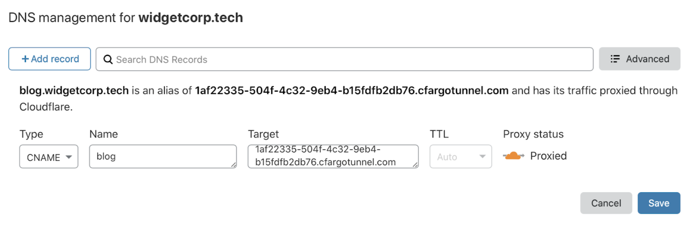

# DNS record

| Before you start |
|---|
| 1. [Create an Argo Tunnel](/create-tunnel) |
| 2. [Configure the Tunnel](/configuration) |

## Route traffic from the Cloudflare dashboard

When you create an Argo Tunnel, Cloudflare generates a subdomain of `cfargotunnel.com` with the UUID of the created Tunnel. You can treat that subdomain as if it were an origin target in the Cloudflare dashboard.

Unlike publicly routable IP addresses, the subdomain will only proxy traffic for a DNS record in the same Cloudflare account. If someone discovers your subdomain UUID, they will not be able to create a DNS record in another account or system to proxy traffic to the address.

1. Navigate to the **Cloudflare DNS** tab.
2. Create a new CNAME record and input the subdomain of your Tunnel into the Target field.
3. Click **Save**.



The DNS record is distinct from the state of the Tunnel. You can create DNS records that point to a Tunnel that is not currently running. If the Tunnel stops running, the DNS record will not be deleted. If you point the DNS record to a Tunnel not currently running visitors will see a 1016 error message.

Additionally, you can create multiple DNS records that point to the same Tunnel subdomain. If you are routing traffic from multiple hostnames to multiple services, you will need to create a CNAME entry for each hostname. The CNAME entries will share the same target.

## Route traffic from the command line

You can create DNS records from `cloudflared`, which will provision a CNAME record that points to the subdomain of a specific Tunnel. The result is the same as creation from the dashboard above.

To do so, run the following command.

```sh
$ cloudflared tunnel route dns <UUID or NAME> www.app.com
```

The command will create a CNAME record that points to the Tunnel subdomain, but will not proxy traffic if the Tunnel is not currently running.

Note: this command requires the `cert.pem` file.
