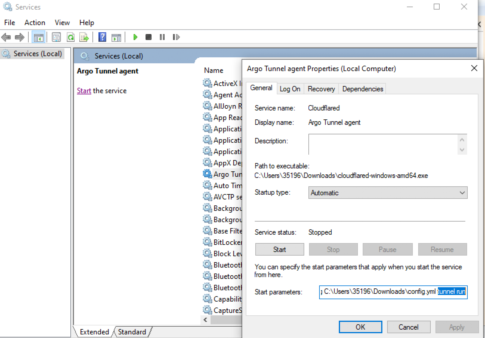

# Run as a service

<Aside type='warning' header='⚠️ THIS PAGE IS OUTDATED'>

We're no longer maintaining this page. **It will be deleted on Feb 8, 2021**. Please visit the new [Cloudflare for Teams documentation](https://developers.cloudflare.com/cloudflare-one/teams-docs-changes) instead.

</Aside>

| Before you start |
|---|
| 1. [Create a Tunnel](/create-tunnel) |
| 2. [Configure the Tunnel](/configuration) |
| 3. [Configure routing to the Tunnel](/routing-to-tunnel) |

Argo Tunnel can install itself as a system service on Linux and Windows and as a launch agent on macOS.

By default, Argo Tunnel expects all of the configuration to exist in the `cloudflared/config.yml` configuration file. The available options are documented on the [configuration file reference](/configuration/config/), but at a minimum you must specify the following arguments to run as a service:

|Argument|Description|
|---|---|
|`url`|The destination for proxied traffic in your environment if your origin is not listening on localhost:8080|
|`tunnel`|The UUID of your Tunnel
|`credentials-file`|The location of the credentials file for your Tunnel|

You must [create the Tunnel](/create-tunnel), and its credentials file, prior to installing it as a service. Creating the Tunnel in advance will generate the `credentials` file.

If you do not want to create the tunnel in advance, you must install `cloudflared` with the `--legacy` flag.

## Linux

Run the following command:

```sh
$ sudo cloudflared service install
```

If you have already logged in and have a configuration file in `~/.cloudflared/`, these will be copied to `/etc/cloudflared/`.

If you do not have a configuration file, you will need to create a config.yml file with fields listed above. You can pass a custom file by running `cloudflared --config CONFIG-FILE service install`.

<Aside>

The above arguments are required for pre-configured Argo Tunnel deployments. If you are using legacy Argo Tunnel, without names, you can append the `--legacy` flag when running cloudflared tunnel install command.

</Aside>

## macOS

### Run at login

Open a Terminal and run the following command:

```sh
$ cloudflared service install
```

Argo Tunnel will be installed as a launch agent, and start whenever you log in, using your local user configuration found in `~/.cloudflared/`.

#### Manually start the service

Run the following command:

```sh
$ launchctl start com.cloudflare.cloudflared
```

Output will be logged to `~/Library/Logs/com.cloudflare.cloudflared.err.log` and `~/Library/Logs/com.cloudflare.cloudflared.out.log`.

### Run at boot

Run the following command:

```sh
$ sudo cloudflared service install
```

Argo Tunnel will be installed as a launch daemon, and start whenever your system boots, using your configuration found in `/etc/cloudflared`.

#### Manually start the service

Run the following command:

```sh
$ sudo launchctl start com.cloudflare.cloudflared
```

Output will be logged to `/Library/Logs/com.cloudflare.cloudflared.err.log` and `/Library/Logs/com.cloudflare.cloudflared.out.log`.

## Windows

To run as a service on Windows, you must specify four arguments in the configuration file.

|Argument|Description|
|---|---|
|`url`|The destination for proxied traffic in your environment if your origin is not listening on localhost:8080|
|`tunnel`|The UUID of your Tunnel
|`credentials-file`|The location of the credentials file for your Tunnel|
|`logfile`|The location to store `cloudflared` logs`

Before starting, download `cloudflared` and place the `cloudflared.exe` in a location accessible to the OS. This example assumes the executable is stored in the following location:

```bash
C:\Cloudflared\bin\cloudflared.exe
```

### Install `cloudflared`

1. Open a Command Prompt with Administrator privileges.

2. Run the following command to install `cloudflared` as a service.

```bash
C:\Cloudflared\bin\cloudflared.exe service install
```

Assuming Windows is installed to `C:\`, when running as a service, Argo Tunnel expects the configuration to be available at the following path:

`C:\Windows\system32\config\systemprofile\.cloudflared\config.yml` .

You can copy your local configuration from:

`%UserProfile%\.cloudflared\config.yml`.

If that directory is not available, you can execute the following command to create the directory.

```bash
mkdir C:\Windows\System32\config\systemprofile\.cloudflared
```

### (Optional) Specify a custom location for the config file

By default, the Windows service runs in “access” client mode. If you need to specify a custom config file location, you can do so in the Windows registry after the service has been installed ([MSDN reference](https://docs.microsoft.com/en-us/dotnet/api/system.serviceprocess.servicebase.onstart?view=netframework-4.7.2)):

1. Open `regedit`.
2. Go to the registry key `HKEY_LOCAL_MACHINE\SYSTEM\CurrentControlSet\Services\Cloudflared`.
3. Edit the `ImagePath` value to include `--config <path-to-config>`.

Additionally, you will need to add `tunnel run` arguments and, in some cases, a pointer to the config file. For example: `.../cloudflared.exe tunnel [--config FILE] run`.

### Authenticate `cloudflared`

Run the following command to login to Cloudflare and authenticate `cloudflared`.

```bash
C:\Cloudflared\bin\cloudflared.exe login
```

Once authenticated, copy the certificate to the `systemprofile` directory.

```bash
copy C:\Users\%USERNAME%\.cloudflared\cert.pem C:\Windows\System32\config\systemprofile\.cloudflared
```

### Create, route, and configure the Tunnel

You can now [create](/create-tunnel) an Argo Tunnel and edit the configuration file to [configure](/configuration) `cloudflared`. We recommend setting the [routing](/routing-to-tunnel) before running the service in the next step.

<Aside>

When running `cloudflared` as a service on Windows, the path to the credentials file in the configuration file needs to be explicitly specified.

```yaml
---
filename: config.yml
---
credentials-file: C:\ABSOLUTE\PATH\TO\UUID.json
```

In some cases, forward slashes should be used to set the explicit path to the credentials file.

* In "Raw" YAML scalars, the backslash should be used directly. For example, `C:\UUID.json`.
* In single-quoted scalars, the backslash should be used directly. For example, `'C:\UUID.json'`.
* In double-quoted scalars, a forward slash should be used or the backslash should be escaped. For example, `"C:\\UUID.json"`.

```yaml
---
filename: config.yml
---
credentials-file: C:/UUID.json
```

</Aside>

### Start the service

To start the service, open the Service Manager, select `Argo Tunnel agent` and open the `General` tab. In the `Start parameters` field, specify the location of the configuration file and place the `tunnel run` command after the path. For example:



Once applied, you can click `Start` to run the Tunnel.

<Aside>

The Services UI in Windows will allow you to set Start parameters, and Start the service, but in some cases it may not save. This appears to be a general issue within Windows Services configuration. To save the `Start parameters` value, we recommend [editing the values](https://stackoverflow.com/questions/1488851/how-to-pass-a-parameter-to-a-windows-service-once-and-for-all-at-install-instead) in the Services registry directly.

</Aside>

Alternatively, you can run the following commands to start Argo Tunnel as a service:

```
C:\> sc start cloudflared tunnel run
```

If you are a Powershell user, run this command instead:

```
PS C:> Start-Service cloudflared tunnel run
```

<Aside>

`cloudflared` will set up Recovery Properties of the service so it restarts on failure, but **this feature is not fully supported on Windows Server 2003 and Windows XP.**

</Aside>

### Start on reboot

You can configure the service in Windows to start if the machine reboots.

1. Open the Registry Editor as an administrator.
2. Navigate to `Computer\HKEY_LOCAL_MACHINE\SYSTEM\CurrentControlSet\Services\Cloudflared`
3. Edit the entry `ImagePath` to contain the path to the `cloudflared` binary.
4. Add the parameters that were configured above; for example the path to the configuration file and the `tunnel run` command.
