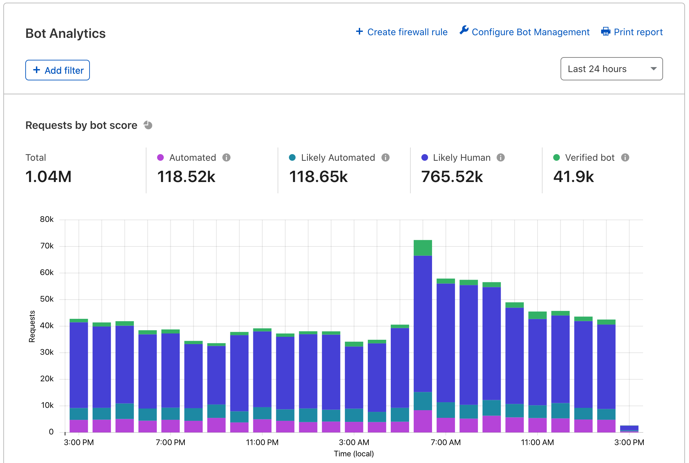

import AnalyticsFeatures from "../_partials/_analytics-features.md"

# Bot Management for Enterprise Analytics

Enterprise customers with Bot Management can use **Bot Analytics** to dynamically examine bot traffic.

## Access

To use Bot Analytics, open the Cloudflare dashboard and select **Firewall** > **Bots**. 

## Features

We provide a full tour of Bot Analytics in [our blog post](https://blog.cloudflare.com/introducing-bot-analytics/). At a high level, the tool includes:

- **Requests by bot score**: View your total domain traffic and segment it vertically by traffic type. Keep an eye on “automated” and “likely automated” subsets of traffic.
- **Bot score distribution**: View the number of requests assigned a bot score 1 through 99.
- **Bot score source**: Identify the most common detection engines used to score your traffic. Hover over a tooltip to learn more about each engine.
- **Top requests by attribute**: View more detailed information on specific IP addresses and more.

<AnalyticsFeatures/>

## Common uses

Bot Management customers can gain more value from by using Bot Analytics to:

- Understand traffic during the initial onboarding phase
- Tune Firewall Rules to be effective, but not overly aggressive
- Study recent attacks to find trends and detailed information
- Learn more about Cloudflare’s detection engines with real data

## Finding a bot score threshold

Before deploying Bot Management on live traffic, use Bot Analytics to determine your domain's sensitivity to bot traffic. This sensitivity can then be translated into effective Firewall Rules.

While we recommend customers block or challenge bot scores below 30, some customers, such as those with ecommerce domains, may want to be less aggressive to prevent false positives and lost revenue. Other domains may perform better with aggressive thresholds, depending on expected traffic and revenue sources. The best approach is to slowly increase your threshold to prevent widespread issues. We recommend our customers do the following:

1. After adding Bot Management to your account, visit Bot Analytics to ensure the tool has been added to your dashboard. If you experience issues, log out and then log back in.

2. Apply a filter on bot scores of 1 or **automated** traffic. Sort through the IP addresses, ASNs, and other data points at the bottom of the page. We suggest blocking or challenging traffic with a score of 1, so you’ll want to look for any traffic that should be *exempted* from this action. You may have API or mobile app traffic that appears on the page.

3. Create a Firewall Rule that challenges or blocks scores of 1 and exempts any good, automated requests. Monitor for a few days.

4. Apply filters to different subsets of your traffic — consider a filter on 2 through 29 scores (**likely automated** traffic). Some customers prefer to use the slider tool to identify large spikes in bot scores. For example, you may find that your mobile app is routinely scored 37. Identify nuances in your traffic that may require special attention and try to find a range of scores that you can confidently block or challenge.

5. Create Firewall Rules that mitigate these subsets of traffic. Again, monitor over the course of a few days to ensure traffic is being correctly impacted.

After completing these steps, you will have an initial set of Firewall Rules and insights to guide your use of Bot Management. You can always come back to Bot Analytics for help with additional tuning.

<Aside type='note' header='Important'>

If you were a Cloudflare customer before adding Bot Management, you can view past analytics (including traffic from before you purchased Bot Management). This means that you will be able to sort through traffic insights immediately.

New customers should give Bot Analytics a few days to gather data. You should only begin blocking or challenging traffic after checking for possible exemptions or special endpoints.

</Aside>

## API

The data that powers Bot Analytics is available via GraphQL API. We provide access to bot scores, bot sources, and bot “decisions” (“automated,” “likely automated,” etc.). Read the [GraphQL Analytics API documentation](https://developers.cloudflare.com/analytics/graphql-api) for more information about GraphQL and basic querying.