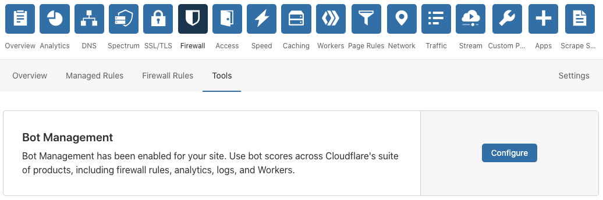
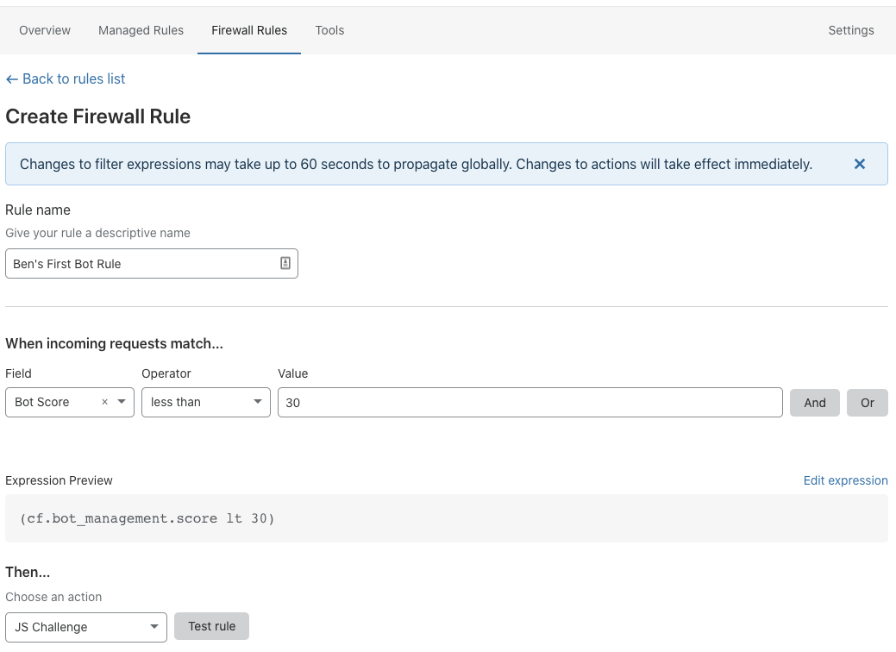

# Bot Management for Enterprise

Bot Management for Enterprise is a paid add-on that provides sophisticated bot protection for your site. Customers can identify automated traffic, take appropriate action, and view detailed analytics within the dashboard. Bot Management also supports custom solutions via Workers and Logs.

Our Enterprise product provides the most flexibility to customers by:

- Generating a bot score of 1-99 for every request. Scores below 30 are commonly associated with bot traffic.
- Allowing customers to action on this score with Firewall Rules or Workers.
- Allowing customers to view this score in Bot Analytics or Logs.

The bot score is an indicator of certainty. For example, a score of 1 means we are quite certain the request was automated while a score of 99 means we are quite certain the request came from a human.

## Enable Bot Management for Enterprise

To enable Bot Management, contact your account team. After it’s enabled, Bot Management displays under **Firewall** > **Tools**.

Our Solutions Engineering team will work with you to begin setting up the product. Most customers choose to write Firewall Rules that will block or challenge traffic based on bot score. Others just use Bot Analytics or perform custom actions using our Workers platform.

## How we detect bots

Cloudflare’s approach to bot detection is multifaceted. We use different detection engines, including **Heuristics**, **Machine Learning (ML)**, **Anomaly Detection (AD)**, and **JavaScript Detections (JSD)** to identify different types of traffic — then we distil our findings into a simple bot score. Collectively, these detection engines are both rigorous and exhaustive.

The **Heuristics** engine processes all requests. Cloudflare conducts a number of heuristic checks to identify automated traffic, and requests are matched against a growing database of malicious fingerprints. The Heuristics engine immediately gives automated requests a score of one.

The **Machine Learning (ML)** engine accounts for the majority of all detections, human and bot. This approach leverages our global network, which proxies billions of requests daily, to identify both automated and human traffic. We constantly train the ML engine to become more accurate and adapt to new threats. Most importantly, this engine learns from traffic across all Cloudflare sites and uses these insights to score traffic while honoring our [strict privacy standards](https://www.cloudflare.com/privacypolicy/). This engine produces scores two through 99.

The **Anomaly Detection (AD)** engine is an optional detection engine that uses a form of unsupervised learning. We record a baseline of your site’s traffic and use the baseline to intelligently detect outlier requests. This approach is user agent-agnostic and can be turned on or off by your account team. 

Cloudflare does not recommend AD for sites that use SSL for SaaS or expect large amounts of API traffic. The AD engine immediately gives automated requests a score of one.

Lastly, the **JavaScript Detections (JSD)** engine is an optional engine that identifies headless browsers and other malicious fingerprints. This engine conducts a lightweight, invisible JavaScript injection on the client side of any request while honoring our [strict privacy standards](https://www.cloudflare.com/privacypolicy/). We do not collect any personally-identifiable information during the process. The JSD engine either blocks, challenges, or passes requests to other engines. JSD is enabled by default but completely optional. To adjust your settings, open the Bot Management Configuration page from **Firewall** > **Tools**.

## Bot Management variables

Bot Management provides access to several new variables available within the Firewall expression builder.

- Bot Score: An integer used to isolate bot requests which ranges from 1-99. Lower scores usually indicate automated traffic, while higher scores indicate human traffic. Most traffic scored below 30 comes from bots.
- Verified Bot: A boolean value that is true if the request comes from a good bot, like Google or Bing. Most customers choose to allow this traffic.
- Serves Static Resource: An identifier that matches file extensions for many types of static resources. Use this variable if you send emails that retrieve static images.

These variables are also available as part of the [request.cf](https://developers.cloudflare.com/workers/reference/apis/request/#the-cf-object) object via [Cloudflare Workers(https://developers.cloudflare.com/workers/):

- request.cf.botManagement.score
- request.cf.botManagement.verifiedBot
- request.cf.botManagement.staticResource

## Best practices and examples

As you get started, keep the following in mind.

Bot Score is different from Threat Score. Bot Score identifies bots, and Threat Score measures IP reputation across our services. Most customers achieve the best results by blocking or challenging bot scores lower than 30 and avoiding IP reputation entirely.

For example, you can issue a JS challenge in response to bot scores lower than 30 with a Firewall Rule.

Enter a name for your rule and then match your settings to the settings shown below.

Deploy the rule and watch the results! For additional help with Firewall Rules, review the [Firewall Rules documentation](https://developers.cloudflare.com/firewall/cf-firewall-rules/order-priority).

Use **Bot Analytics and Logs** to view Bot Management’s impact without affecting live traffic. To integrate with a third-party service to analyze traffic, select **Log** as an action from Firewall.

**Some automated traffic is good!** To allow good bots like Google or Bing, use the **Verified Bot** field in your rules. To treat mobile traffic differently, use the user agent or IP address fields in Firewall Rules. You can also fill out an [online application](https://docs.google.com/forms/d/e/1FAIpQLSdqYNuULEypMnp4i5pROSc-uP6x65Xub9svD27mb8JChA_-XA/viewform?usp=sf_link) to suggest new bots for verification.

