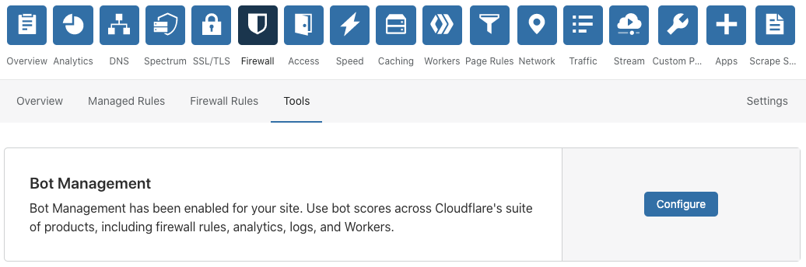
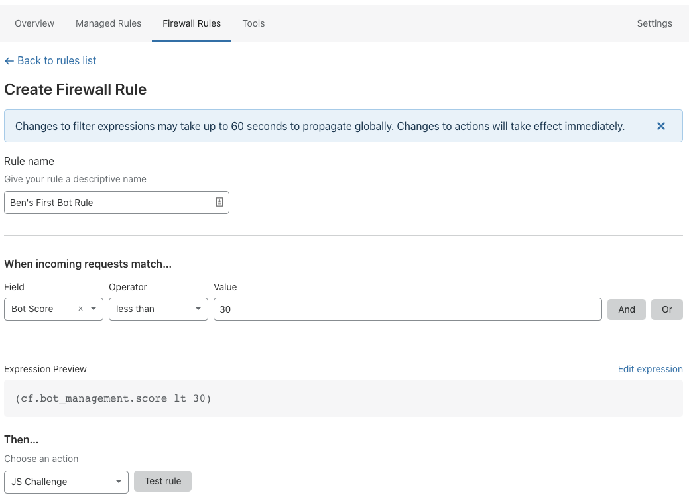

# Getting started with Bot Management for Enterprise

Bot Management for Enterprise is a paid add-on that provides sophisticated bot protection for your domain. Customers can identify automated traffic, take appropriate action, and view detailed analytics within the dashboard. Bot Management also supports custom solutions via Workers and Logs.

Our Enterprise product provides the most flexibility to customers by:

- Generating a bot score of 1-99 for every request. Scores below 30 are commonly associated with bot traffic.
- Allowing customers to action on this score with Firewall Rules or Workers.
- Allowing customers to view this score in Bot Analytics or Logs.

The bot score is an indicator of certainty. For example, a score of 1 means we are quite certain the request was automated while a score of 99 means we are quite certain the request came from a human.

## Enable Bot Management for Enterprise

To enable Bot Management, contact your account team. After it’s enabled, Bot Management displays under **Firewall** > **Bots**.

Our Solutions Engineering team will work with you to begin setting up the product. Most customers choose to write Firewall Rules that will block or challenge traffic based on bot score. Others just use Bot Analytics or perform custom actions using our Workers platform.

For more guidance on tuning your Firewall Rules, see [Finding a bot score threshold](/bot-analytics#finding-a-bot-score-threshold/).

## Bot Management variables

Bot Management provides access to several new variables available within the Firewall expression builder.

- Bot Score: An integer used to isolate bot requests which ranges from 1-99. Lower scores usually indicate automated traffic, while higher scores indicate human traffic. Most traffic scored below 30 comes from bots.
- Verified Bot: A boolean value that is true if the request comes from a good bot, like Google or Bing. Most customers choose to allow this traffic.
- Serves Static Resource: An identifier that matches file extensions for many types of static resources. Use this variable if you send emails that retrieve static images.

These variables are also available as part of the [request.cf](https://developers.cloudflare.com/workers/reference/apis/request/#the-cf-object) object via [Cloudflare Workers](https://developers.cloudflare.com/workers/):

- request.cf.botManagement.score
- request.cf.botManagement.verifiedBot
- request.cf.botManagement.staticResource

For a list of supported file types for static resources, see [Static resource protection](/about/static-resources/).

## Best practices and examples

As you get started, keep the following in mind.

Bot Score is different from Threat Score. Bot Score identifies bots, and Threat Score measures IP reputation across our services. Most customers achieve the best results by blocking or challenging bot scores lower than 30 and avoiding IP reputation entirely.

For example, you can issue a JS challenge in response to bot scores lower than 30 with a Firewall Rule.

Enter a name for your rule and then match your settings to the settings shown below.

Deploy the rule and watch the results! For additional help with Firewall Rules, review the [Firewall Rules documentation](https://developers.cloudflare.com/firewall/cf-firewall-rules/order-priority).

Use **Bot Analytics and Logs** to view Bot Management’s impact without affecting live traffic. To integrate with a third-party service to analyze traffic, select **Log** as an action from Firewall.

**Some automated traffic is good!** To allow good bots like Google or Bing, use the **Verified Bot** field in your rules. To treat mobile traffic differently, use the user agent or IP address fields in Firewall Rules. You can also fill out an [online application](https://docs.google.com/forms/d/e/1FAIpQLSdqYNuULEypMnp4i5pROSc-uP6x65Xub9svD27mb8JChA_-XA/viewform?usp=sf_link) to suggest new bots for verification.

## Analytics

For more on analytics, see [Bot Analytics](/bot-analytics/bm-subscription/).