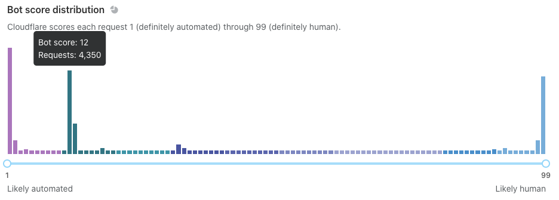

import StaticResourcesBM from "../_partials/_static-resources-bm.md"

# Get started with Bot Management for Enterprise

Bot Management for Enterprise is a paid add-on that provides sophisticated bot protection for your domain. Customers can identify automated traffic, take appropriate action, and view detailed analytics within the dashboard. Bot Management also supports custom solutions via Workers and Logs.

This Enterprise product provides the most flexibility to customers by:

- Generating a [bot score](/concepts/bot-score) of 1-99 for every request. Scores below 30 are commonly associated with bot traffic.
- Allowing customers to take action on this score with Firewall Rules or [`Workers`](https://developers.cloudflare.com/workers/runtime-apis/request#incomingrequestcfproperties).
- Allowing customers to view this score in Bot Analytics or Logs.

---

## Enable Bot Management for Enterprise

Our Solutions Engineering team will work with you to begin setting up the product. Most customers choose to write Firewall rules, but others use Bot Analytics or perform custom actions using our Workers platform.

### Before you begin

- Make sure you have purchased Bot Management for Enterprise (should be visible at **Firewall** > **Bots**).
- Review the following concepts:

  - [Bot score](/concepts/bot-score): Learn how Cloudflare scores bot requests.
  - [Challenge Solve Rate (CSR)](/concepts/challenge-solve-rate): Learn how to evaluate the effectiveness of Firewall rules.
  - [Bot tags](/concepts/cloudflare-bot-tags): Learn more about *why* Cloudflare classified a request a certain way.

### Step 1 — Configure Bot Management

Decide whether you want to enable [JavaScript detections](/reference/javascript-detections) to help identify bots.

To enable this feature, go to **Firewall** > **Bots**.

### Step 2 — Monitor domain traffic

Before deploying Bot Management on live traffic, use [Bot Analytics](/bot-analytics/bm-subscription) to determine your domain's sensitivity to bot traffic.

Go to **Firewall** > **Bots** and examine the following traffic segments:
- **Automated traffic**: Bot scores of 1
- **Likely automated traffic**: Bots scores of 2 through 29
- **Other traffic groups**: Any additional large spikes in bot scores

For **automated** traffic, sort through the IP addresses, ASNs, and other data points at the bottom of the page. Look for any traffic that *should not* be blocked — commonly API or mobile app traffic. Do the same for **likely automated** traffic.

Use the slider tool to identify **other traffic groups**. For example, you may find that traffic from your mobile app is routinely scored at 12. 

At the end of your analysis, you should:

- Have a range of scores you can confidently block or challenge
- Understand nuances in your traffic that may require special attention

<Aside type='note' header='Important'>

If you were a Cloudflare customer before adding Bot Management, you can view past analytics. This means that you will be able to sort through traffic insights immediately.

New customers should give Bot Analytics a few days to gather data. You should only begin blocking or challenging traffic after checking for possible exemptions or special endpoints.

</Aside>

### Step 3 — Create a Firewall Rule for automated traffic

Based on your analysis of **automated** traffic, create a [Firewall Rule](https://developers.cloudflare.com/firewall/cf-firewall-rules) that **challenges** scores of 1 but still allows good, automated requests. Monitor that rule for a few days to make sure you are targeting the right traffic (user agents, IP addresses, API or mobile traffic).

<Example>
<table style='table-layout:fixed; width:100%'>
  <thead>
  <tr>
    <th>Expression</th>
    <th style='width:20%'>Action</th>
  </tr>
  </thead>
  <tbody>
    <tr>
      <td><code>(cf.bot_management.score eq 1) and not (cf.bot_management.verified_bot)</code></td>
      <td><em>JS Challenge</em></td>
    </tr>
  </tbody>
</table>
</Example>

### Step 4 — Create additional Firewall Rules

Create Firewall Rules that address **likely automated** traffic and **other traffic groups**. For suggested bot thresholds and other considerations, see our [Firewall Rules documentation](https://developers.cloudflare.com/firewall/recipes/challenge-bad-bots) or [Bot Management variables](/reference/bot-management-variables).

Cloudflare recommends that most customers block or challenge bot scores **below 30**, but your domain might vary:

- If you want to minimize false positives and lost revenue — such as ecommerce domains — you might permit requests with lower bot scores to access your domain.
- If you want to increase protection and minimize bot traffic, you might challenge higher bot scores.
- If your Firewall Rule has a [**Challenge Solve Rate (CSR)**](/concepts/challenge-solve-rate) higher than 3%, consider lowering your challenge threshold.

The best approach is to start small and slowly increase your threshold to prevent widespread issues.

### Step 5 — Continue monitoring domain traffic

You can adjust your Firewall Rules at any point. Set aside time to review [Bot Analytics](/bot-analytics/bm-subscription) and [Firewall Events](https://developers.cloudflare.com/waf/analytics) to see if your rules need additional tuning.

---

## Other considerations

### Static resources

<StaticResourcesBM/>

For more details, see [Static resource protection](/reference/static-resources).

### Verified bots

Some automated traffic is good! To allow good bots like Google or Bing, use the **Verified Bot** field in your rules. If you see a verified bot that Cloudflare is not [currently tracking](https://developers.cloudflare.com/firewall/known-issues-and-faq#bots-currently-detected), fill out an [online application](https://docs.google.com/forms/d/e/1FAIpQLSdqYNuULEypMnp4i5pROSc-uP6x65Xub9svD27mb8JChA_-XA/viewform?usp=sf_link).

### Mobile traffic
To treat mobile traffic differently, use the `user agent` or `IP address` fields when creating your Firewall Rules.