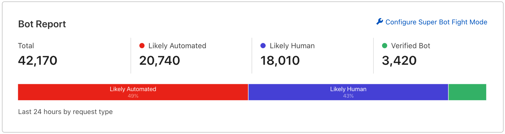

import EnableSteps from "../_partials/_get-started-pro-biz-steps.md"
import RulesetEngine from "../_partials/_bfm-ruleset-engine.md"

# Get started with Super Bot Fight Mode (Pro)

Super Bot Fight Mode is included in your Pro subscription. When enabled, the product:

- Identifies traffic matching patterns of known bots
- Can challenge or block bots
- Offers protection for static resources
- Provides limited analytics to help you understand bot traffic

## Enable Super Bot Fight Mode

<EnableSteps/>

## Analytics

### Bot Report

Use the **Bot Report** to monitor bot traffic for the past 24 hours.

To access the **Bot Report**, go to **Firewall** > **Bots**. If you see a double-digit percentage of automated traffic, you may want to upgrade to [Bot Management](../bm-subscription) to save money on origin costs and protect your domain from large-scale attacks.

### Firewall events

You can see bot-related actions by going to **Firewall** > **Overview**. Any requests challenged by this product will be labeled **Super Bot Fight Mode** in the **Service** field. This allows you to observe, analyze, and follow trends in your bot traffic over time.

## Ruleset Engine

<RulesetEngine/>