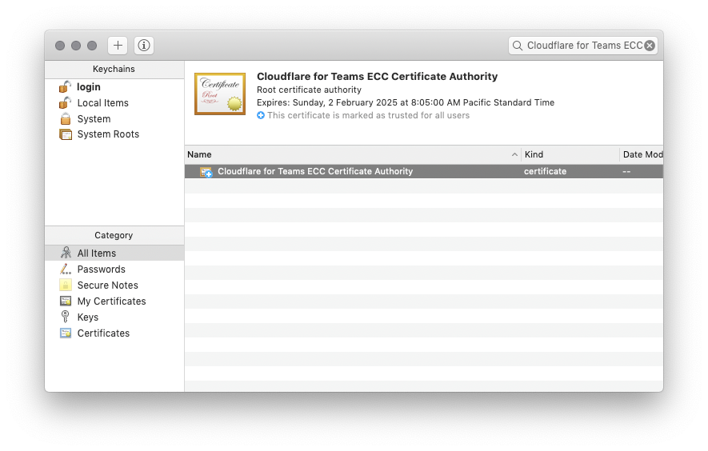

# Uninstall

The installation helper tools only install the **Cloudflare for Teams Root CA**  and the **WARP** client.

Here's how to remove them: 

### macOS

#### Cloudflare WARP
1. Close Cloudflare WARP
   1. Select Cloudflare WARP from your menu bar (top right).
   2. Select the Gear Icon
   3. Close Cloudflare WARP by selecting "Quit".
2. Open **Finder**.
3. Select **Applications**. 
4. Drag **Cloudflare WARP** to your Trash icon in the Dock.

#### Cloudflare for Teams Root CA
1. Open Keychain Access.
The fastest way to do this is open Spotlight (Command + Space) and type: *Keychain Access*.
2. Search "*Cloudflare for Teams ECC Certificate Authority*" in search input (top right).
3. Right-click *Cloudflare for Teams ECC Certificate Authority* and select **Delete "Cloudflare for Teams ECC Certificate Authority"**.

### Windows
Both the **Cloudflare for Teams Root CA** and the **Cloudflare WARP** client may be uninstalled in Windows 10 settings:

#### Cloudflare WARP
1. Close Cloudflare WARP
   1. Select *Cloudflare WARP* from your task bar (bottom right).
   2. Select the Gear Icon.
   3. Close Cloudflare WARP by selecting **Quit**.
2. Open the *Start* menu.
3. Type "*Add and remove programs*" and press enter.
4. Search "*Cloudflare*" in the Apps & Features list.
5. Uninstall Cloudflare WARP.

#### Cloudflare for Teams Root CA

1. Open the *Start* menu,
1. Type "*MMC*" into the run box. This will launch Microsoft Management Console
1. Select *File*, then *Add/Remove Snap-In*
1. Select the "*Cloudflare for Teams ECC Certificate Authority*" root certificate.
1. In the right click context menu, click *Delete*.
1. Click *Yes*.