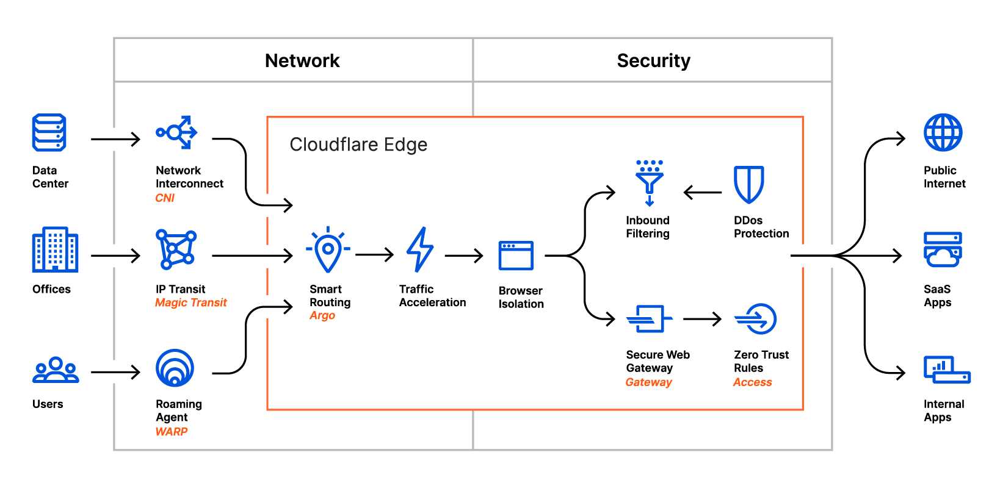

<ContentColumn>

# Welcome
Welcome to the Cloudflare Browser Isolation beta program!

<Aside type="warning" header="Beta">
Browser Isolation is currently in beta. If you are interested in participating, <a href="https://www.cloudflare.com/teams/lp/browser-isolation/">request a beta invite</a>.
</Aside>

## How Browser Isolation works

Browser Isolation works by intercepting normal browsing traffic and serving a web-native remote client to the user's browser instead of the normal HTML/CSS/Javascript content.

This web-based remoting client connects to a containerized headless browser hosted in a nearby Cloudflare data center. The remote browser is responsible for downloading and executing all foreign webpage code (HTML, CSS, Javascript etc), and serves network vector drawing commands over the network to your local browser.

Since HTML, CSS and Javascript content is not served to the user's browser, it is protected from malicious websites that attempt to exploit web-based vulnerabilities.

The web-based remoting client is downloaded, installed and updated on-the-fly without requiring the user to make any changes to their browser.

Our network automatically provisions, scales and upgrades browsers for users. The first time a user connects, we assign them a remote browser, and when all active tabs are closed the remote browser is automatically destroyed after 15 minutes of inactivity.

Remote browsing is invisible to the user who continues to use their browser normally without changing their preferred browser and habits. Every open tab and window is automatically isolated.

While the Browser Isolation technology does not require any additional software to be installed on a device, it does require a method to reroute Internet traffic through Cloudflare's network. This is achieved by leveraging Cloudflare WARP, a VPN-like desktop agent that securely tunnels your Internet traffic through a nearby Cloudflare data center.

## Get started

Browser Isolation can be tested in two ways:

1. **Self managed**: Test isolated browsing with admin controls using your own Cloudflare for Teams organization.
1. **Cloudflare managed**: Test isolated browsing without admin controls using a Cloudflare managed `browser-beta` organization.

### Self managed
In order to test Browser Isolation with administrative controls you will need your own Cloudflare for Teams account. Follow [this guide](/administration/setup-teams) to get started.

### Cloudflare managed
Users interested in quickly testing Browser Isolation without setting up a Cloudflare for Teams organization should follow the [installation guide](/installation) to connect via the `browser-beta` organisation.

</ContentColumn>
