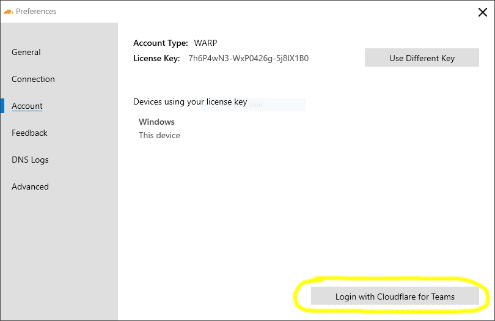

# Installation on Windows

## Install WARP client
Download and install the WARP client here: https://developers.cloudflare.com/warp-client/warp-for-everyone/setting-up/windows.

## Install the Cloudflare Root CA
Advanced security features including Browser Isolation require users to install and trust the Cloudflare root certificate on their machine or device.

Follow this article to configure the Cloudflare root certificate on your device: https://developers.cloudflare.com/cloudflare-one/connections/connect-devices/warp/install-cloudflare-cert

## Manually configure a Cloudflare for Teams device registration

1. Click on the Cloudflare Logo in the System Tray.
1. Select the gear icon.
1. Next, click **Preferences**.
1. Select the **Account** tab.
1. Click **Login with Cloudflare for Teams**.
1. Enter your organization name (if your auth domain were `https://example.cloudflareaccess.com`, you would enter `example`).
1. Complete the authentication steps required by your organization.

## Start using Browser Isolation

You're now ready to start using an isolated browser. Get started [here](/usage).