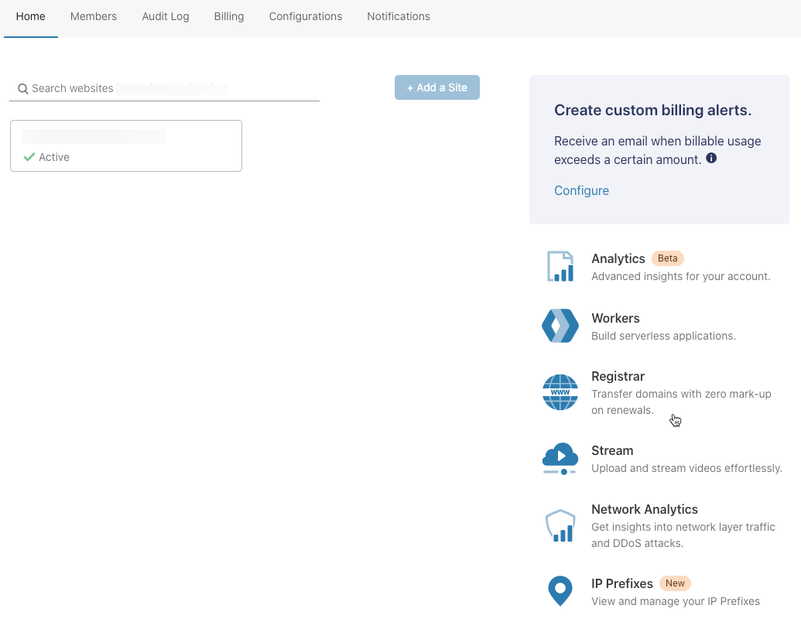
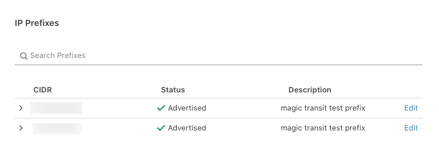
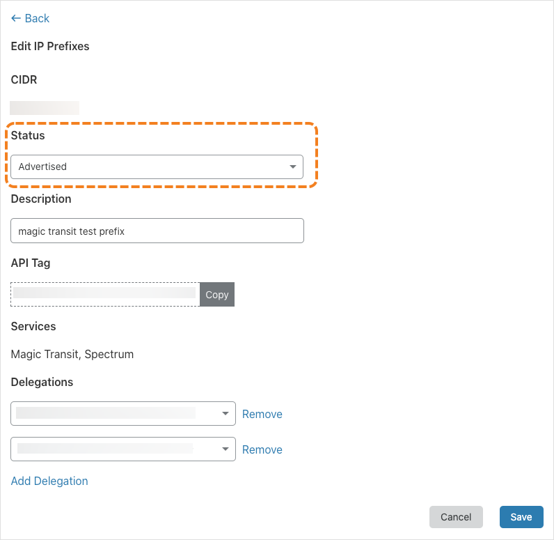
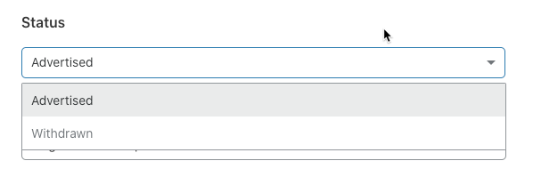
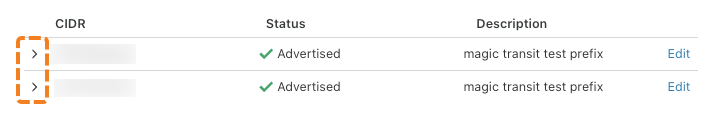
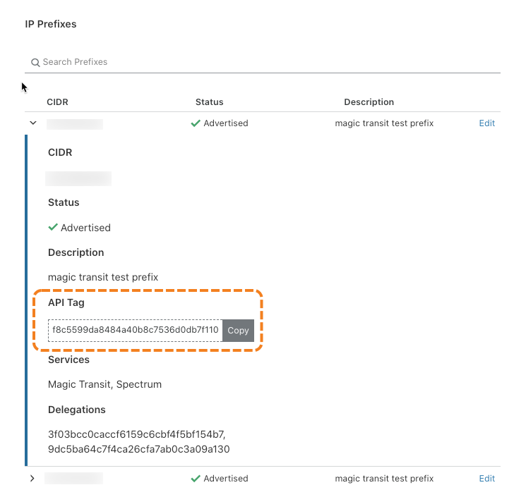

# Configure dynamic advertisement

<Aside>

To ensure smooth operation in general and simplify the advertisement process during an attack scenario, refer to [best practices](/dynamic-advertisement/best-practices) when managing dynamic advertisement.

</Aside>

--------------------------------

## Use the IP Prefixes page to configure dynamic advertisement

To configure IP prefix assignment from your Cloudflare account home, use the **Status** drop-down list in the **IP Prefixes** dialog, as outlined in these steps:

1. Log in to your Cloudflare accounts **Home** page and click **IP Prefixes**.

  

  The **IP Prefixes** page displays.

2. To edit a prefix, click the **Edit** link associated with the entry.

  

  The **Edit IP Prefixes** dialog displays.

  

1. To configure prefix advertisement, select the _Advertised_ or _Withdrawn_ option from the **Status** drop-down list.

  

4. Click **Save** to commit your changes.

Once you have committed your changes, it takes 2–7 minutes to enable advertisement and approximately 15 minutes to disable (withdraw) advertisement.

--------------------------------

## Use the Cloudflare API to configure dynamic advertisement

To configure prefix advertisement with the Cloudflare API, use the [IP Address Management and Dynamic Advertisement](https://api.cloudflare.com/#ip-address-management-dynamic-advertisement-properties) API.

Most dynamic advertisement operations require that you supply the Cloudflare ID for any prefix you want to access with the Cloudflare API. The following section outlines how to obtain Prefix IDs.

--------------------------------

## Get prefix IDs

You can obtain Prefix IDs from the **IP Prefixes** page in your Cloudflare account home or via the [List Prefixes](https://api.cloudflare.com/#ip-address-management-prefixes-list-prefixes) operation in the Cloudflare API.

To obtain Prefix IDs from the **IP Prefixes** page, follow these steps:

1. Click the expander widget associated with the entry for which you want to obtain the Prefix ID.

  

  The prefix details display.

2. To obtain the Prefix ID, refer to the **API Tag** value. To add the value to your clipboard, click **Copy**.

  
