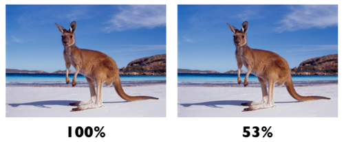

# Activate Polish

Polish strips metadata to accelerate image downloads and reduce image size through lossy or lossless compression. Learn more about Polish from our [blog post](https://blog.cloudflare.com/introducing-polish-automatic-image-optimizati/).



<Aside type="note" header="Note">

[Cloudflare Image Resizing](https://developers.cloudflare.com/images/) also optimizes images cached in the Cloudflare network, but is only available for Business and Enterprise users.

</Aside>

## Polish compression options

### Lossless 

Lossless attempts to strip most metadata, e.g. EXIF data, but does not change the image detail. Effectively, when uncompressed, a lossless image is identical to the original.

### Lossy

Lossy attempts to strip most metadata and compresses images by approximately 15 percent. When uncompressed, some of the redundant information from the original image is lost.
Lossy has the same effect as Lossless when applied to PNG.

<Aside type="note" header="Note">

With Lossless and Lossy modes, Cloudflare attempts to strip as much metadata as possible. However, Cloudflare cannot guarantee stripping all metadata because other factors, such as caching status, might affect which metadata is finally sent in the response.

</Aside>

### WebP

WebP is a modern image format providing superior lossless and lossy compression for images. WebP lossless images are approximately 26 percent smaller than PNGs, while lossy images are 25 to 34 percent smaller than JPEGs. Currently, WebP is only supported in Firefox, Google Chrome, and Opera. You can learn more in our [blog post](https://blog.cloudflare.com/a-very-webp-new-year-from-cloudflare/).

Polish creates and caches a WebP version of the image and delivers it to the browser if the `Accept` header from the browser includes WebP and the compressed image is significantly smaller than the lossy or lossless compression.

`Accept: text/html,application/xhtml+xml,application/xml;q=0.9,image/webp,*/*;q=0.8`

## Activate Polish

Images in the [cache must be purged](/how-to/purge-cache) or expired before seeing any changes in Polish settings.

1. Log in to the Cloudflare dashboard.
1. Click the appropriate Cloudflare account for the domain where you will activate Polish.
1. Click **Speed** > **Optimization** > **Polish**.
1. Under **Polish**, choose **Lossy** or **Lossless** from the dropdown menu.
1. (Optional) Click **WebP**. By applying WebP, Cloudflare can further optimize .png and .jpeg images stored in the origin server.

To ensure WebP is not served from cache to a browser lacking WebP support, disable WebP at your origin web server when using Polish.

## Verify Polish is active

```
cf-bgj: imgq:85  

cf-polished: qual=85, origFmt=jpeg, origSize=95005  

cf-cache-status: HIT
```

- The `cf-bgj` header confirms that Cloudflare applied Polish and returns the image quality setting (`imgq`).
- The `cf-polished` header represents the Polish status and returns the image quality setting (`qual`) and original size (`origSize`).
- The `cf-cache-status` confirms that the image has been cached and Polish can be applied.

WebP conversion does not change the image URL. The `Content-Type` HTTP header tells the browser the original format of an image.

To view a list of common `Cf-Polished` statuses and how to troubleshoot them, see [Common Cf-Polished statuses](/reference/common-cf-published-statuses).
