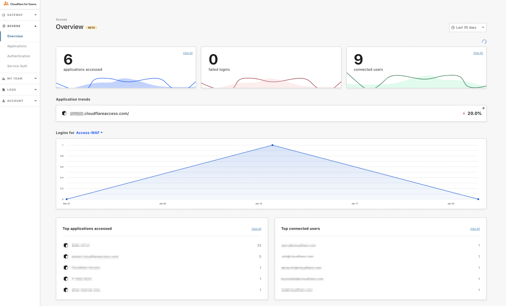
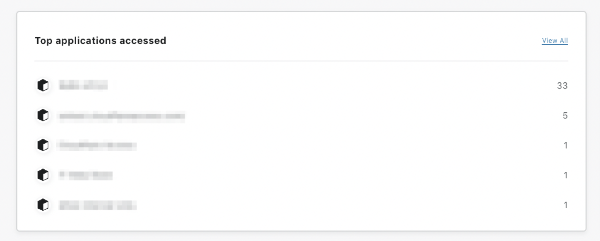

# Access overview 

You can use the Overview page to see how many applications have been accessed, how many logins have failed, and how many users are currently connected to your applications.

In the top-right corner, specify the time period you are interested in looking into. 

## Top applications accessed
See which applications were the most accessed in the time period you've specified. By clicking **View all**, the Overview will show you a list of all applications accessed in that time period.

## Top connected users
See which users logged in most frequently. By clicking **View all**, the Overview will show you a list of all users who have authenticated in your time period of choice.