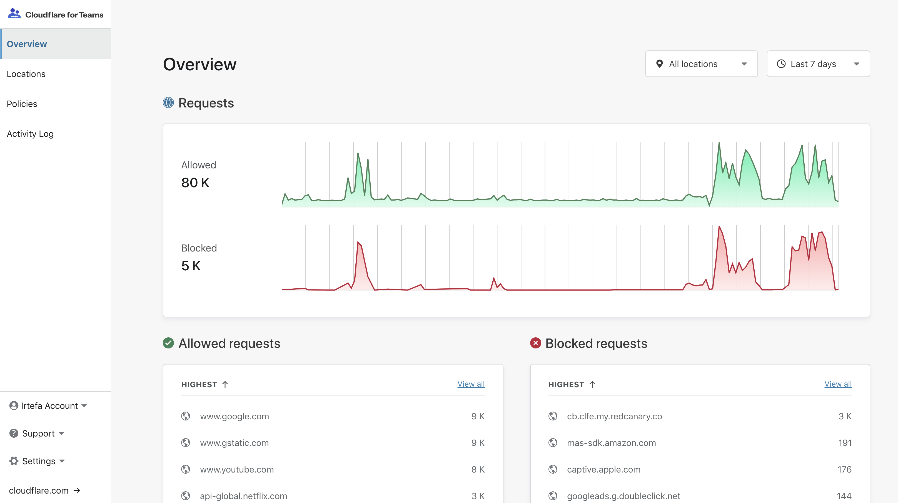
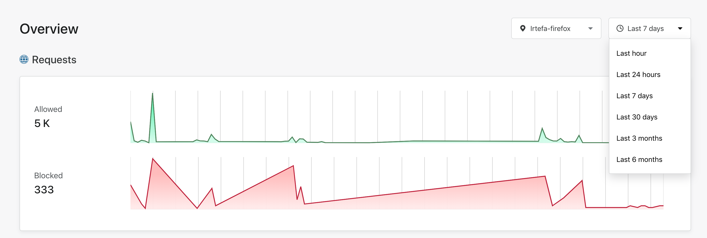
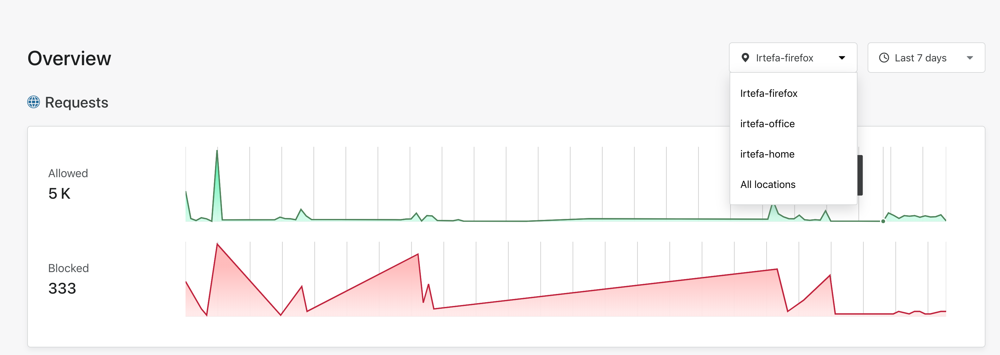
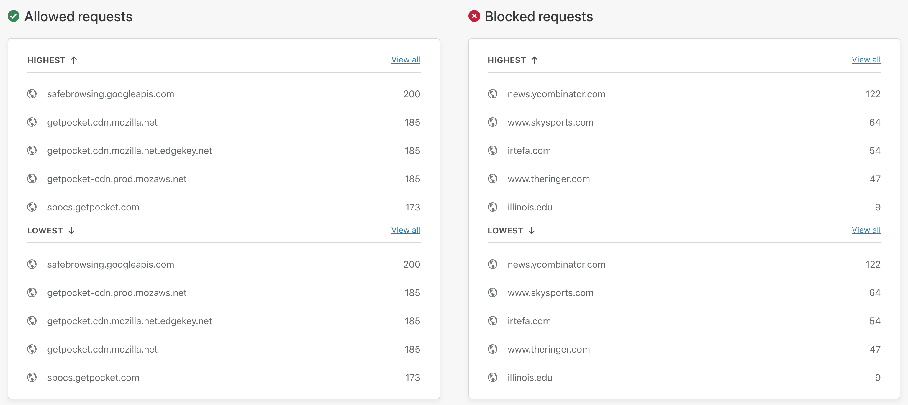
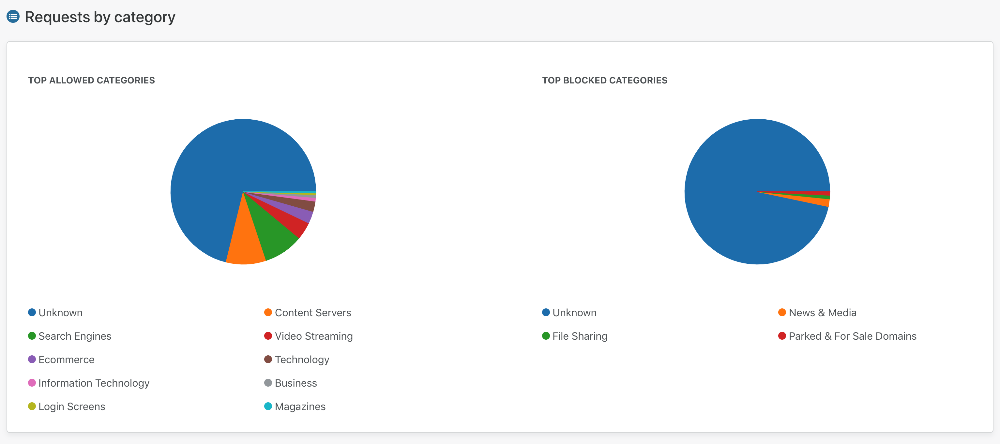

# Gateway overview 

You can use the Overview page to see the top allowed and blocked requests across all of your locations. You can filter the data by selecting a specific location and/or a time.

## Filter analytics by time
You can filter the overview page by time. You can view analytics for the last 24 hours using Gateway's Free tier.

## Filter analytics by location
You can filter by the location name.

## View top allowed and blocked domains
You can view most seen allowed and blocked requests across your locations.

## View top allowed and blocked categories
You can view the top allowed and blocked categories across your locations.
