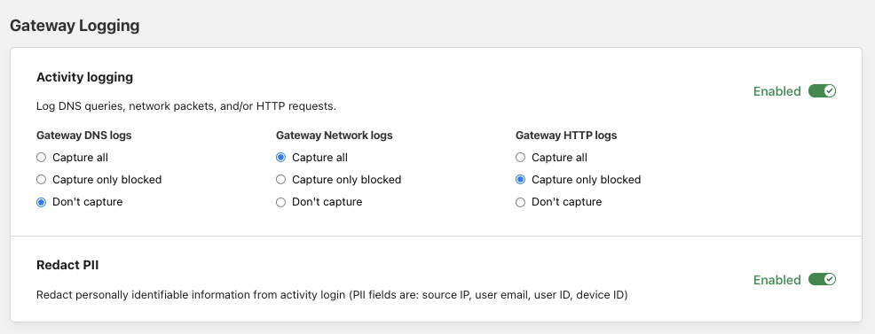

# Gateway 

Use the Analytics - Gateway page to see the top allowed and blocked requests across all of your locations. You can filter the data by selecting a specific location and/or time.

## Selective Logging

By default, Gateway logs all events, including DNS queries and HTTP requests that are allowed and not a risk. You can customize what type of events are logged by navigating to **Settings** > **Network** and indicating your preferences under **Gateway Selective Logging**.

