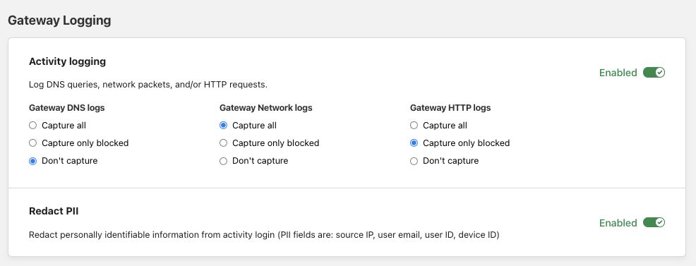
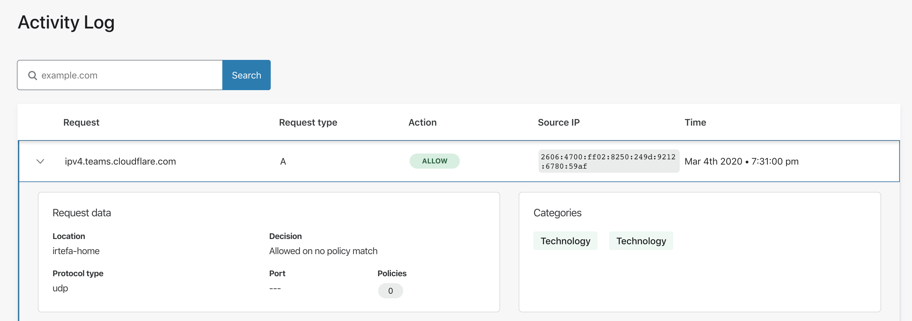
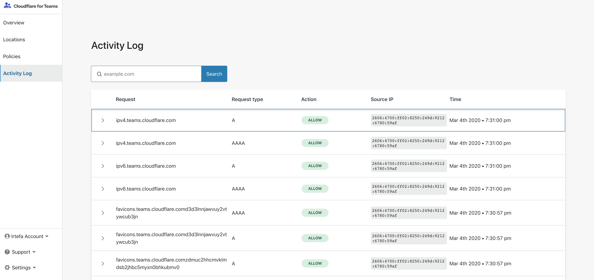

# Activity logs

<Aside>

Activity log will only show the public Source IP address. Private IP addresses are NAT-ed behind a public IP address. 

</Aside>

The Activity log allows you to see individual DNS queries made from your locations or, for paid subscribers, HTTP requests made from WARP clients. You can use the Activity log to investigate anomalies in your network. You can search by the DNS query or HTTP request and investigate each by clicking on a row.

## Selective Logging

By default, Gateway logs all events, including DNS queries and HTTP requests that are allowed and not a risk. You can customize what type of events are logged by navigating to **Settings** > **Network** and indicating your preferences under **Gateway Selective Logging**.

## DNS logs

When you click on the row, you can see information related to the identity that is making the DNS request and attributes relevant to the DNS queries.

### Explanation of the fields

<TableWrap>

| Field | Description |
| ----- | ----------- |
| **Request** | The name of the domain that was queried. |
| **Request type** | The DNS query type. [This page](https://en.wikipedia.org/wiki/List_of_DNS_record_types) contains a list of all the DNS query types. |
| **Action** | What Action Gateway applied. For example: Allowed, Blocked etc. |
| **Source IP** | The public source IP of the DNS request. |
| **Time** | The timestamp of the DNS query. |
| **Location** | The location from where the DNS query was made. |
| **Protocol type** | The protocol that was used to make the DNS query. |
| **Port** | The port that was used to make the DNS request. |
| **Policies** | The name of the policy if it applies to the DNS request. |
| **Categories** | Category or categories associated with the DNS request. |

</TableWrap>

## HTTP logs

### Explanation of the fields

<TableWrap>

| Field | Description |
| ----- | ----------- |
| **Host** | The hostname in the HTTP header for the HTTP request. |
| **Method** | The HTTP method used for the request (e.g., GET, POST, etc.) |
| **Decision** | The Gateway action taken based on the first rule that matched. For example: Allowed, Blocked, Bypass, etc. |
| **Time** | The timestamp of the HTTP request |
| **URL** | The full URL of the HTTP request |
| **Device** | The ID of the device that made the request. This is generated by the WARP client on the device that created the request. |
| **Referer** | The Referer request header contains the address of the page making the request. |
| **User Agent** | The user agent header sent in the request by the originating device. |
| **File Name** | File name string if a file transfer occurred or was attempted. |
| **HTTP version** | The HTTP version of the origin that Gateway connected to on behalf of the user. |
| **Policy details** | The policy corresponding to the decision Gateway made based on the traffic criteria of the request. |

</TableWrap>

### Isolate requests

When a user creates a policy to isolate traffic, the initial request that triggers isolation will be logged as an `Isolate` decision and the `is_isolated` field will return `false`. This is because that initial request is not isolated yet — but it initiates an isolated session.

Since the request is generated in an isolated browser, the result is rendered in the isolated browser and rendered back to the user securely. This request and all subsequent requests in the isolated browser are logged to include the terminal Gateway action that gets applied (e.g. Allow / Block) and the `is_isolated` field as `true`. 

## Network logs

### Explanation of the fields

<TableWrap>

| Field | Description |
| ----- | ----------- |
| **Source IP** | The IP address of the user sending the packet. | 
| **Destination IP** | The IP address of the packet’s target. |
| **Source port** | The source port number for the packet. |
| **Destination port** | The destination port number for the packet. |
| **Protocol** | The protocol over which the packet was sent. |
| **SNI** | The host whose Server Name Indication (SNI) header Gateway will filter traffic against. |
| **Policy name** | The name of the policy corresponding to the decision Gateway made. |
| **Policy ID** | The ID of the policy enforcing the decision Gateway made. |
| **Device ID** | The ID of the device that sent the packet. This is generated by the WARP client. |
| **User ID** | The ID of the user sending the packet. This is generated by the WARP client. |
| **User email** | The email address of the user sending the packet. This is generated by the WARP client. | 
| **Categories** | Category or categories associated with the packet. |

</TableWrap>

## Cloudflare logpush integration

<Aside>

This feature is only available on the Zero Trust Enterprise plan.

</Aside>

You can configure the automatic export of logs from Cloudflare Gateway to third-party storage destinations or to security information and event management (SIEM) tools. Once exported, your team can analyze and audit the data as needed.

This feature builds on Cloudflare's Logpush Service — check out the Logpush documentation to find a list of fields logged for both [HTTP](https://developers.cloudflare.com/logs/reference/log-fields/account/gateway_http) and [DNS](https://developers.cloudflare.com/logs/reference/log-fields/account/gateway_dns) activity.

To enable this feature on the Zero Trust dashboard:

1. Navigate to **Logs > Logpush**.
1. Click **Connect a service**.
1. Enter a **Job name**.
1. From the drop-down menu, choose whether to export the *Gateway DNS* or the *Gateway HTTP* dataset.
1. Next, select the data fields you want to export.
1. In the **Advanced settings** card, choose the timestamp format you prefer, and whether you want to enable logs sampling.
1. Click **Next**.
1. Select the service you want to export your Gateway logs to. 
1. Next, follow the service-specific instructions on the Zero Trust UI to validate your destination.

The setup of your logpush integration is now complete. Logpush will send updated logs every five minutes to your selected destination. 

You can configure multiple destinations and monitor for any issues by returning to the Logpush page.