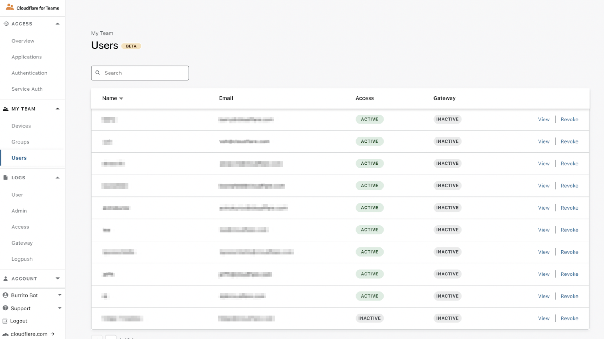
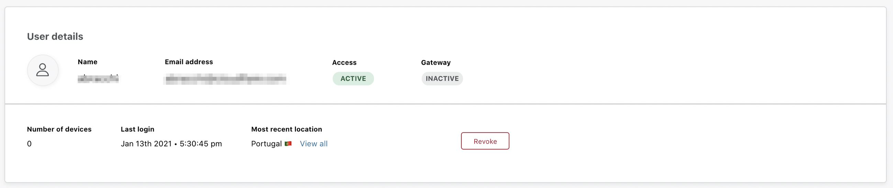
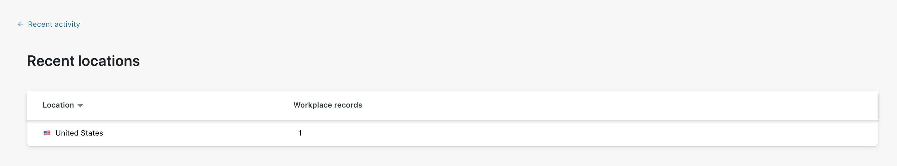

# User logs

Teams allows you to consult a comprehensive list of users who have authenticated to Teams. For each user that logged in, you can see their name, their email address, and whether they’re actively utilizing a seat in both Access and Gateway. 

## Revoke user sessions

Clicking the **Revoke** button will terminate all currently active sessions for that user, and revoke access to all their connected devices. If you want to prevent this user from logging in again, you need to manually remove this user from any existing policies that grant them access to your applications. 

## View user details

Clicking the View button for any user will show you details for that user, such as:
* Their user details
 
* Devices they have connected to Teams
* Their recent logins

Click on **View all activity** to see a full list of the user’s login events.

## Workplace records

Wokplace records show the amount of unique sessions the user has initiated from a given country in the current billing period. To view workplace records:

1. In the Users page, locate the user whose workplace records you want to see.
1. Click **View**.
1. In the **User details** section, under the **Most recent location** field, click on the View all button. 

 

To change the granularity with which workplace records are shown, adjust your [global session duration](/identity/users/session-management#global-session-duration). An informative threshold can be **24 hours**. 
