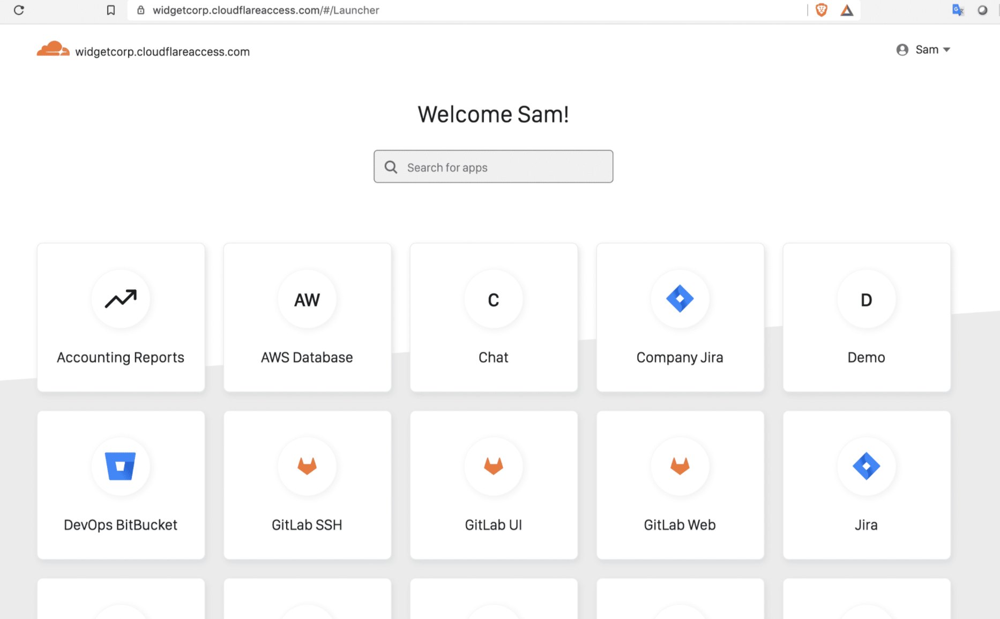
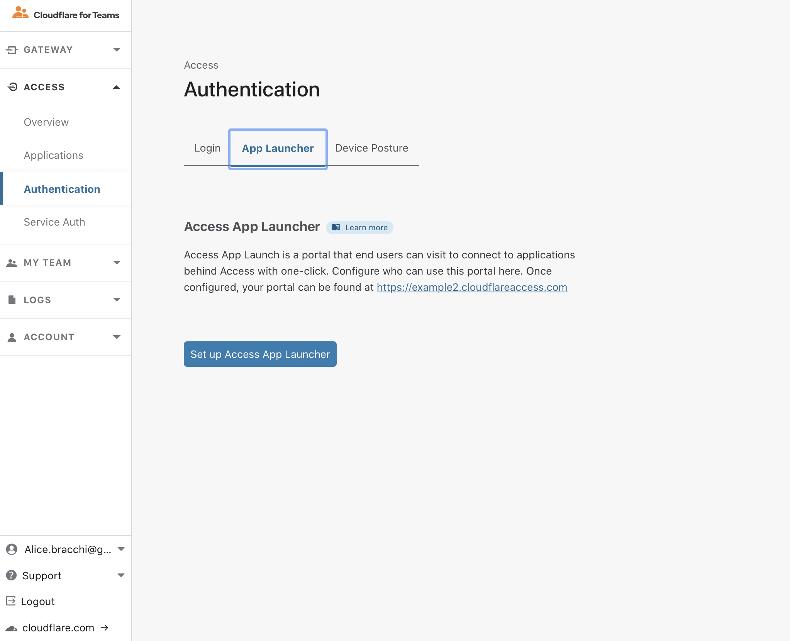
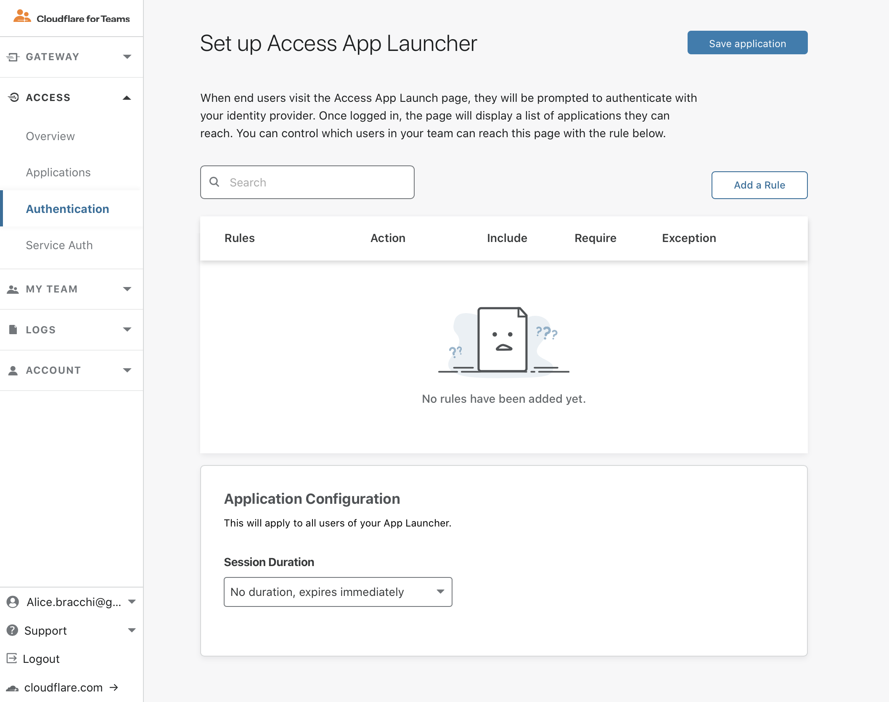

# App Launcher

With the App Launcher portal, users can easily open all applications that they have access to from a single dashboard.

The App Launcher is available at an [team domain](/glossary#team-domain) unique to your Cloudflare Access account. The domain will resemble `mycompany.cloudflareaccess.com`, where `mycompany` is the organization name you created for Cloudflare Access.

Users log in using one of the identity providers configured for the account. Once Access authenticates the user, the App Launcher displays applications they are authorized to use, in the form of application tiles. Clicking on an application tile launches the application’s hostname, sending the user to that tool as part of their SSO flow.

Tiles have a one-to-one relationship with each application you create in Access. If you create one application for general access to your Jira deployment and a separate application that restricts requests to a particular Jira path, a user authorized for both will see separate tiles for each. The tile names displayed in the Access App Launcher portal correspond to the application names listed in the Application list.

## Enable the App Launcher

By default, the Access App Launcher portal is disabled. To enable it, an administrator must configure a policy that defines which users can access the portal.

The App Launcher policy defines which users can access the portal. It does not impact or change any rules about the applications secured behind Access.

To enable the App Launcher:

1. Navigate to **Access > Authentication** on the [Teams dashboard](https://dash.teams.cloudflare.com).

1. Select the **App Launcher** tab.

 

1. In the **Configure a rule** dialog, select a rule type from the *Include* drop-down list and then fill in the rule criteria on the right.

 

1. Click **Save**.

The App Launcher is now configured. To edit it, navigate to **Access > Authentication**, and click **Edit Access App Launcher**.
