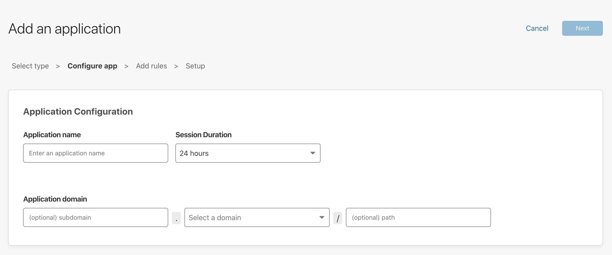

# Application paths

Teams allows you to create unique rules for parts of an application that share a root path. Imagine an example application is deployed at `dashboard.com/eng` that anyone on the engineering team should be able to access. However, a tool deployed at `dashboard.com/eng/exec` should only be accessed by the executive team. 

When multiple rules are set for a common root path, its subdomains do not inherit rules. For example, when setting rules for `dashboard.com/eng` and `dashboard.com/eng/exec` separately, `dashboard.com/eng/exec` does not inherit the rule set for `dashboard.com/eng`. Instead, the more specific rule takes precedence.

In the Teams dashboard, when adding a [self-hosted web application](/applications/configure-apps/self-hosted-apps), you can choose to protect the entire website by entering its apex domain, or alternatively, you can specify any subdomains and paths in the dedicated fields.

<Aside>

Teams does not support port numbers in the URL. Requests to URLs with port numbers are redirected to the URL and the port numbers stripped.
</Aside>

## Using wildcards in subdomains and paths

When you create an application for a specific subdomain or path, you can use asterisks (`*`) as wildcards. Wildcards allow you to extend the application you're creating to all the subdomains or paths of a given apex domain.

This is how to use wildcards effectively:

### Protect all subdomains of an apex domain

Using a wildcard in the *subdomain* field **does not cover the apex domain**.

<TableWrap>

| Wildcard | Covers | Doesn't cover |
| -------- | ------ | ------------- |
| `*.example.com` | `alpha.example.com`, `beta.example.com` | `example.com` |

</TableWrap>

### Protect all paths of an apex domain

Using a wildcard in the *path* field **does not cover the apex domain**.

<TableWrap>

| Wildcard | Covers | Doesn't cover |
| -------- | ------ | ------------- |
| `example.com/*` | `example.com/alpha`, `example.com/beta` | `example.com`,`alpha.example.com` |

</TableWrap>

### Protect multi-level subdomains

Using a wildcard in the *subdomain* field to protect multi-level subdomains **does not cover that subdomain's top subdomain nor the apex domain**. 

<TableWrap>

| Wildcard | Covers | Doesn't cover |
| -------- | ------ | ------------- |
| `*.test.example.com` | `alpha.test.example.com`, `beta.test.example.com` | `example.com`, `test.example.com` |

</TableWrap>

### Protect multi-level paths

Using a wildcard in the *path* field to protect multi-level paths **does not cover that subpath's parent path nor the apex domain**. 

<TableWrap>

| Wildcard | Covers | Doesn't cover |
| -------- | ------ | ------------- |
| `example.com/alpha/*` | `example.com/alpha/one`, `example.com/alpha/two` | `example.com`, `example.com/beta` |

</TableWrap>

<Aside type='warning' header='Important'>

You cannot use wildcards to partially match subdomain and path names. Using asterisks in any way other than the ones outlined above **will cause the wildcard to be invalidated**. This means your application won't be effective, and neither will be any rules you may try to enforce on it at a later time.

| Wildcard | Does NOT cover |
| -------- | ------ | 
| `example.com/cat-.*` | `example.com/cat`, `example.com/cat-food` |
| `*ing.example.com` | `ing.example.com`, `engineering.example.com`|

</Aside>

