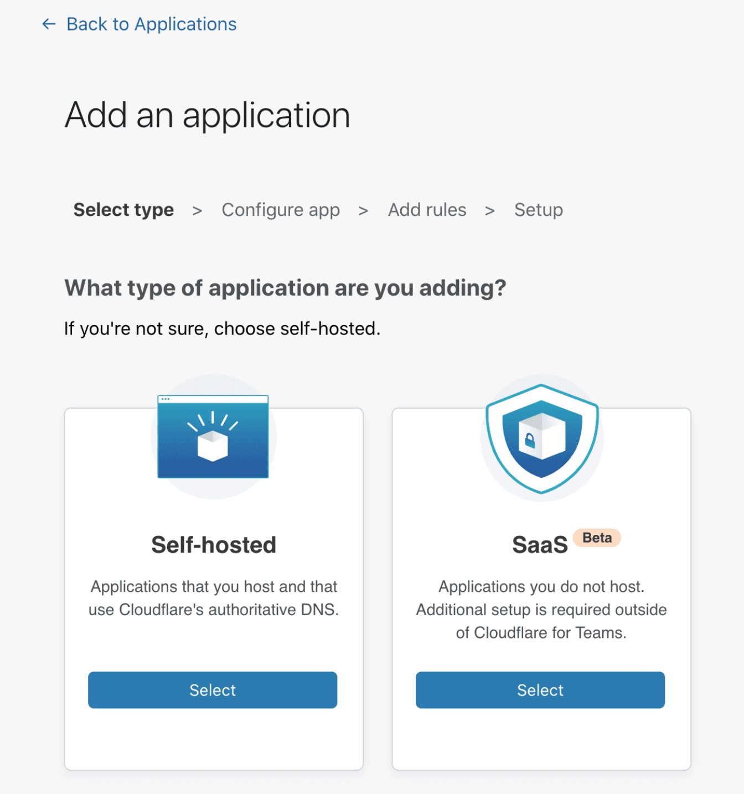
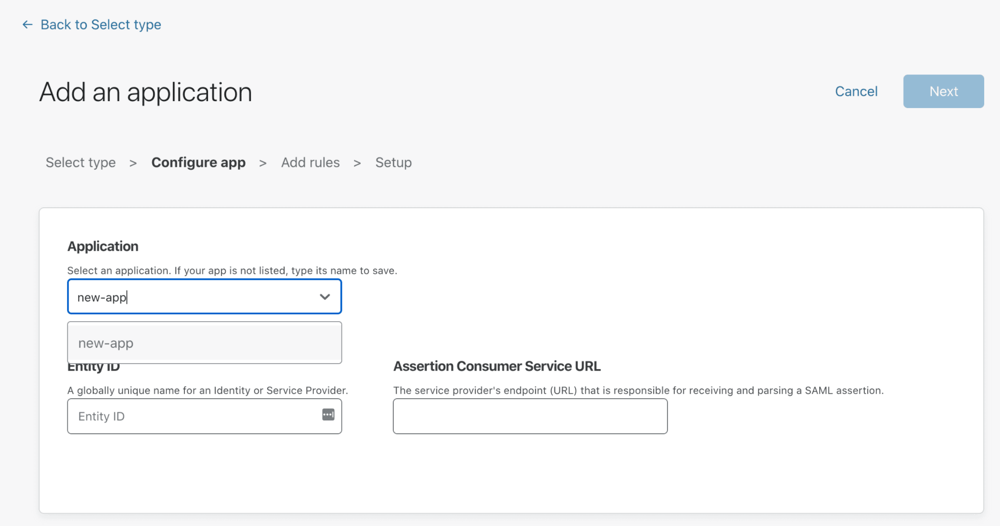
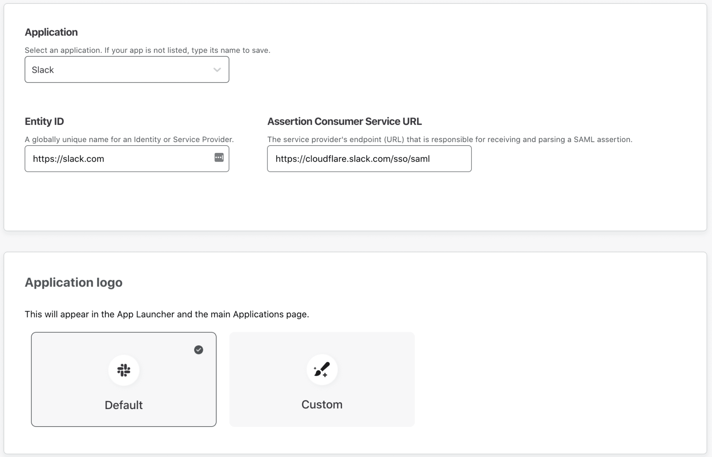
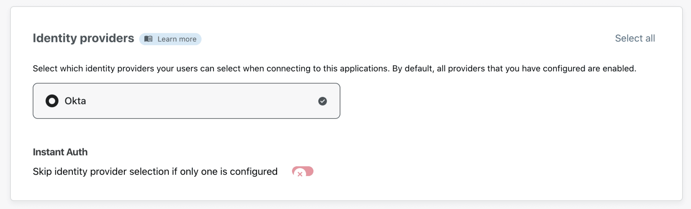

# Web applications

You can protect two types of web applications: SaaS and self-hosted.

**SaaS applications** consist of applications your team relies on that are not hosted by your organization. Examples include Salesforce and Workday. To secure SaaS applications, you must integrate Cloudflare Access with the SaaS application's SSO configuration.

**Self-hosted applications** consist of internal applications that you host in your own environment. These can the data center versions of tools like the Atlassian suite or applications created by your own team. To secure self-hosted applications, you must use Cloudflare's authoritative DNS and [connect the application](/connections/connect-apps) to Cloudflare.

<ButtonGroup>
  <Button type="primary" href="/applications/configure-apps/saas-apps/">SaaS applications</Button>
  <Button type="primary" href="/applications/configure-apps/self-hosted-apps/">Self-hosted applications</Button>
</ButtonGroup>

## Protect SaaS applications

Cloudflare Access allows you to integrate your SaaS products by acting as an identity aggregator, or proxy. This way, users cannot login to SaaS applications without first meeting the criteria you want to introduce.

### 1. Add your application

1. On the [Teams dashboard](https://dash.teams.cloudflare.com), navigate to **Access > Applications**.
2. Click **Add an application**.
3. Select **SaaS**.

4. In the **Configure app** section, select an application from the Application drop-down menu. If your application is not listed, type its name in the textbox and select it.

5. In the **Entity ID** field, provide the unique identifier of your SaaS application.
SaaS applications store this information in different ways.

6. In the **Assertion Consumer Service URL** field, input the service provider’s endpoint for receiving and parsing SAML assertions.

7. Scroll down to the **Application logo** card to choose a logo that will represent the application in the App Launcher and in the Applications page.
You can either:
  * Select **Default** if you want to show the SaaS application’s logo.
  * Select **Custom** if you want to assign a custom logo to the application.

8. Next, scroll down to the **Identity Providers** card to select the identity providers you want to enable for your app.

 

9. Click **Next**.

### 2. Add a policy
You can now configure a policy to control who can access your app.

To learn more about how policies work, read our [Policies](/policies/).

1. First, specify a name for your rule. This is a mandatory field.
2. Specify a policy action.
3. Specify one or more rules in the **Configure a rule** box. You can add as many include, exception, or require statements as needed.
4. Click **Next** to add your application to Access.

### 3. Integrate your SaaS application with Access

Before you begin using your application through Access, your last step is to integrate your SaaS application to Access.

1. First, configure these fields with your SAML SSO-compliant application. Take note of these fields before you click **Done**:

  * Your SSO endpoint
  * Your Access Entity ID or Issuer
  * Your Public key

 

4. Click **Done** to see your application listed on your Applications tab.