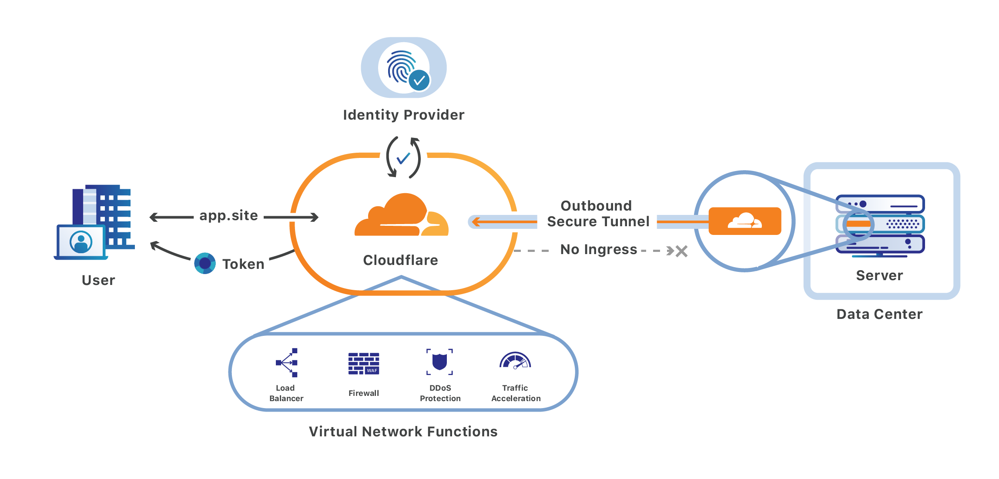
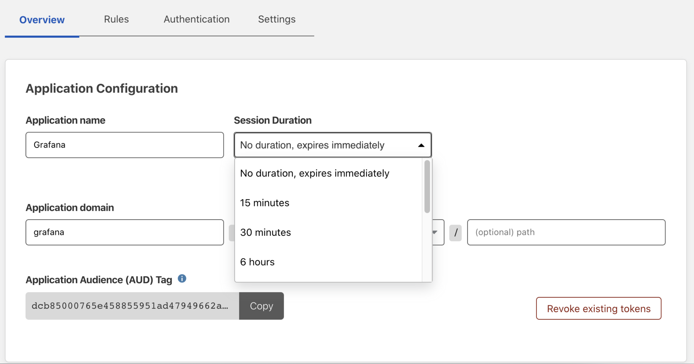

# Self-hosted applications

<Aside>

<b>Before you start</b>

* **<a href="https://support.cloudflare.com/hc/articles/201720164-Creating-a-Cloudflare-account-and-adding-a-website">Add a website to Cloudflare</a>**
* **<a href="https://support.cloudflare.com/hc/articles/205195708">Change your domain nameservers to Cloudflare</a>**

</Aside>

Cloudflare Access allows you to securely publish internal tools and applications to the Internet, by providing an authentication layer using your existing identity providers to control who has access to your applications.

Make sure you create [Zero Trust policies](/policies/zero-trust) before connecting your application to Cloudflare. To [connect your origin](/connections/connect-apps) to Cloudflare, you can use Argo Tunnel. If you do not wish to use Argo Tunnel, you must [validate the token](/identity/users/validating-json/) issued by Cloudflare on your origin.

### 1. Add your application

1. On the [Teams dashboard](https://dash.teams.cloudflare.com), navigate to the **Applications** tab.

1. Click **Add an application**.

1. Select **Self-hosted**.

  

  You are now ready to start configuring your app.

1. Choose an **application name** and set a **session duration**.

  <Aside>
  The session duration for an application will determine the minimum frequency a user will be prompted to authenticate with the configured provider. If you want users to be prompted to authenticate every time they reach your application, select <code>No duration, expires immediately</code>.
  </Aside>

  

1. From the drop-down menu under **Application domain**, select a hostname that will represent the application. The hostname must be an active zone in your Cloudflare account.

  <Aside>
  When specifying an application domain, you can use wildcards to protect multiple parts of an application that share a root path. For more information on how to use wildcards, see the instructions in the <a href="/applications/configure-apps/app-paths#using-wildcards-in-subdomains-and-paths">Application paths</a> page.
  </Aside>

1. Scroll down to the **Application logo** card to configure your application logo.
To add a custom logo, click **Custom** and input a link to your desired image.

  

1. Next, scroll down to the **Identity Providers** card to select the identity providers you want to enable for your app.

1. Click **Next**.

### 2. Add a policy

You can now configure a policy to control who can access your app.

To learn more about how policies work, read our [Policies section](/policies/).

1. First, specify a name for your rule. This is a mandatory field.

1. Specify a policy action.

1. Specify one or more rules in the **Configure a rule** box. You can add as many include, exception, or require statements as needed.

1. Click **Next** to add your application to Access.

### 3. Advanced settings

The **Setup section** allows you to configure a few advanced settings for your application.

1. Configure [Cross-Origin Resource Sharing (CORS) settings](/policies/zero-trust/cors).

 

1. Configure **cookie settings**. For more information, you can read about [session management here](/identity/users/session-management#browser-cookies-configuration-options).

 

1. Configure **`cloudflared` settings**. For more information, read more about [automatic `cloudflared` authentication](/applications/non-http#automatic-cloudflared-authentication).

1. Once you've configured the settings as needed, click **Add application**.

Your application is now available in Cloudflare Access, and will appear in your Applications list. You can proceed with [connecting your origin](/connections/connect-apps) to Cloudflare using this address.