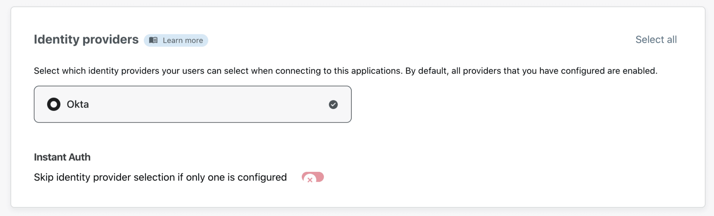

# Web applications

You can protect two types of web applications: SaaS and self-hosted.

**SaaS applications** consist of applications your team relies on that are not hosted by your organization. Examples include Salesforce and Workday. To secure SaaS applications, you must integrate Cloudflare Access with the SaaS application's SSO configuration.

**Self-hosted applications** consist of internal applications that you host in your own environment. These can the data center versions of tools like the Atlassian suite or applications created by your own team. To secure self-hosted applications, you must use Cloudflare's authoritative DNS and [connect the application](/connections/connect-apps) to Cloudflare.

<ButtonGroup>
  <Button type="primary" href="/applications/configure-apps/saas-apps/">SaaS applications</Button>
  <Button type="primary" href="/applications/configure-apps/self-hosted-apps/">Self-hosted applications</Button>
</ButtonGroup>

## Protect self-hosted applications

<Aside>

<b>Before you start</b>

* **<a href="https://support.cloudflare.com/hc/articles/201720164-Creating-a-Cloudflare-account-and-adding-a-website">Add a website to Cloudflare</a>**
* **<a href="https://support.cloudflare.com/hc/articles/205195708">Change your domain nameservers to Cloudflare</a>**

</Aside>

Cloudflare Access allows you to securely publish internal tools and applications to the Internet, by providing an authentication layer using your existing identity providers to control who has access to your applications.

Before you begin setting up your self-hosted application, you will need an active domain on Cloudflare. Access rules will be built to secure that domain.

Create Access rules before connecting your application to Cloudflare. To connect your origin to Cloudflare, you can use [Argo Tunnel](https://developers.cloudflare.com/argo-tunnel/). If you do not wish to use Argo Tunnel, you must [validate the token](/identity/users/json-web-tokens/) issued by Cloudflare on your origin.

### 1. Add your application

1. On the [Teams dashboard](https://dash.teams.cloudflare.com), navigate to the **Applications** tab.

2. Click **Add an application**.

3. Select **Self-hosted**.

You are now ready to start configuring your app.

4. Choose an **application name** and set a **session duration**.
The session duration will determine the minimum frequency a user will be prompted to authenticate with the configured provider.

5. From the drop-down menu under **Application domain**, select a hostname that will represent the application. The hostname must be an active zone in your Cloudflare account.

6. Scroll down to the **Application logo** card to configure your application logo.
To add a custom logo, click **Custom** and input a link to your desired image.

7. Next, scroll down to the **Identity Providers** card to select the identity providers you want to enable for your app.

9. Click **Next**.

### 2. Add a policy
You can now configure a policy to control who can access your app.

To learn more about how policies work, read our [Policies section](/policies/).

1. First, specify a name for your rule. This is a mandatory field.
2. Specify a policy action.
3. Specify one or more rules in the **Configure a rule** box. You can add as many include, exception, or require statements as needed.
4. Click **Next** to add your application to Access.

### 3. Advanced settings

The **Setup section** allows you to configure a few advanced settings for your application.

1. Configure [Cross-Origin Resource Sharing (CORS) settings](/policies/cors/).

 

1. Configure **cookie settings**. For more information, you can read about [session management here](/identity/users/session-management#browser-cookies-configuration-options).

 

1. Configure **`cloudflared` settings**. For more information, read more about [automatic `cloudflared` authentication](/identity/users/automatic-cloudflared-auth).

1. Once you've configured the settings as needed, click **Add application**.

Your application is now available in Cloudflare Access, and will appear in your Applications list. You can proceed with [connecting your origin](/connections/connect-apps) to Cloudflare using this address.