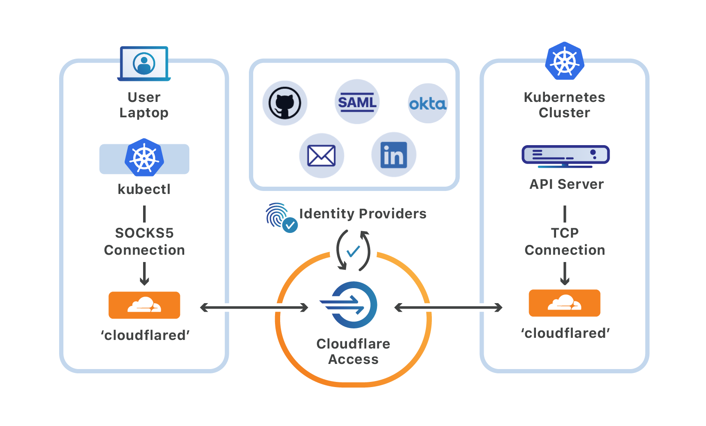

# kubectl

<Aside>

<b>Requirements</b>

* A Cloudflare account
* An **<a href="https://support.cloudflare.com/hc/articles/201720164-Creating-a-Cloudflare-account-and-adding-a-website">active zone</a>**  on Cloudflare
* The `cloudflared` daemon installed on client machines

</Aside>

[kubectl](https://kubernetes.io/docs/tasks/tools/install-kubectl/) is the Kuberentes command-line tool. Users can run commands against Kubernetes clusters using `kubectl` to connect to a Kubernetes cluster's API server.

You can use Cloudflare Access, in combination with Cloudflare Argo Tunnel, to connect to Kubernetes clusters and run `kubectl` commands without a VPN.



## Connect the cluster to Cloudflare

### 1. Install The Cloudflare Daemon On The Host Machine

The Cloudflare daemon, `cloudflared`, will maintain a secure, persistent, outbound-only connection from the machine to Cloudflare. Arbitrary TCP traffic will be proxied over this connection using **Argo Tunnel**.

Follow these instructions to download and install cloudflared in a location that can address the Kubernetes cluster's API server.

### 2. Authenticate The Cloudflare Daemon

1. Run the following command to authenticate `cloudflared` into your Cloudflare account.

```sh
$ cloudflared tunnel login
```

`cloudflared` will open a browser window and prompt you to login to your Cloudflare account.
If you are working on a machine that does not have a browser, or a browser window does not launch, you can copy the URL from the command-line output and visit the URL in a browser on any machine.

2. Once you login, Cloudflare will display the sites that you added to your account.

3. Select the site where you will create a subdomain to represent the resource. For example, if you plan to share the service at `cluster.site.com` select `site.com` from the list.

4. Once selected, cloudflared will download a wildcard certificate for the site. This certificate will allow cloudflared to create a DNS record for a subdomain of the site.

### 3. Secure The Subdomain With Cloudflare Access

Next, protect the subdomain you plan to register with a Cloudflare Access policy. Follow [these instructions](/policies/) to build a new policy to control who can connect to the resource.

For example, if you share the cluster API server at `cluster.site.com`, build a policy to only allow your team members to connect to that subdomain.

### 4. Connect the resource to Cloudflare

`cloudflared` can proxy connections to nonstandard ports.

Run the following command to connect the resource to Cloudflare, replacing the `cluster.site.com` and `tcp://kubernetes.docker.internal:6443` values with your site and port.

```sh
$ cloudflared tunnel --hostname cluster.site.com --url tcp://kubernetes.internal:6443 --socks5=true
```

The proxy allows your local kubectl tool to connect to `cloudflared` via a SOCKS5 proxy, which helps avoid issues with TLS handshakes to the cluster itself. In this model, TLS verification can still be exchanged with the `kubectl` API server without disabling or modifying that flow for end users.

`cloudflared` will confirm that the connection has been established. The process needs to be configured to stay alive and autostart. If the process is killed, end users will not be able to connect.

## **Connect from a client machine**

### 1. Install the Cloudflare daemon on the client machine

Follow the same steps above to download and install `cloudflared` on the client desktop that will connect to the resource. `cloudflared` will need to be installed on each user device that will connect.

### 2. Connect to the resource

Run the following command to create a connection from the device to Cloudflare. Any available port can be specified.

```sh
$ cloudflared access tcp --hostname cluster.site.com --url 127.0.0.1:1234
```

With this service running, you can run a `kubectl` command and `cloudflared` will launch a browser window and prompt the user to authenticate with your SSO provider. Once authenticated, `cloudflared` will expose the connection to the client machine at the local URL specified in the command.

`kubeconfig` does not support proxy command configurations at this time, though the community has submitted plans to do so. In the interim, users can alias the cluster's API server to save time.

```sh
$ alias kubeone="env HTTPS_PROXY=socks5://127.0.0.1:1234 kubectl"
```
