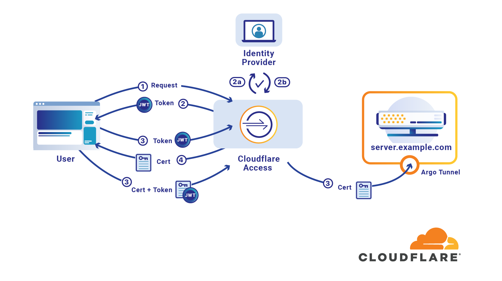

# SSH

Cloudflare Access can secure connections over Secure Shell (SSH). Doing so requires configuring your Access-protected server to use [Argo Tunnel](https://developers.cloudflare.com/argo-tunnel/) for SSH connections. Without Argo Tunnel, Access can be circumvented by using a server's public IP address. Argo Tunnel exposes your origin server directly to Cloudflare only, avoiding external internet connections.

<DirectoryListing path="/applications/non-HTTP/ssh"/>