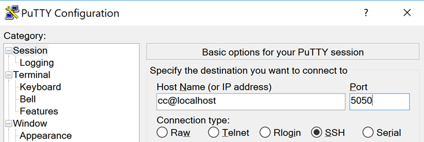
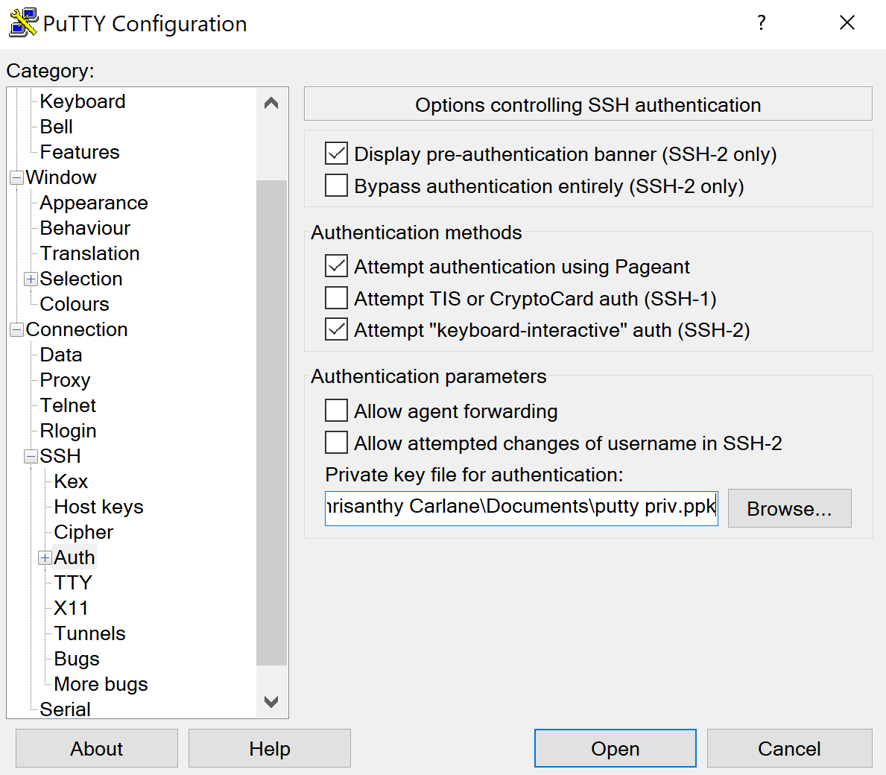
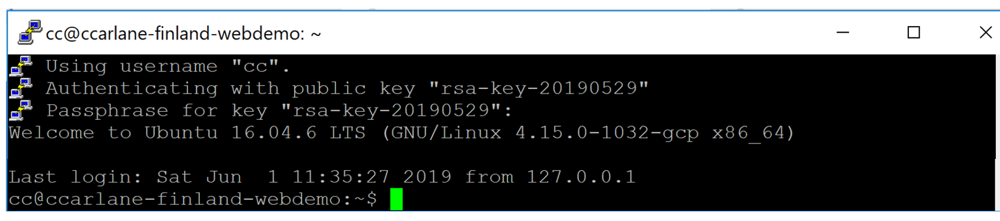

# PuTTY clients

[PuTTY](https://www.chiark.greenend.org.uk/~sgtatham/putty/) is a free implementation of SSH for Windows and Unix platforms. This is a guide on how to configure your machine to use PuTTy to connect to an SSH host secured with Cloudflare Access.

## Before you begin

* [Download](https://developers.cloudflare.com/argo-tunnel/downloads/) the cloudflared.exe file from the options available.
* Ensure you have the hostname of the Host Machine you are reaching.
* Download and install the [PuTTY client](https://www.chiark.greenend.org.uk/~sgtatham/putty/).

## 1. Establish a `cloudflared` connection to the host machine

With the Host Machine hostname, run the following command:

```sh
$ cloudflared.exe access ssh --hostname <the hostname of the SSH server> --url localhost:<unused port>
```
This launches a browser window that prompts you to authenticate your identity credentials.

## 2. Configure PuTTY

1. Open the PuTTY application.

2. Connect to your SSH username at the address of the port you defined to connect to the target machine.



3. (Optional) Define your private key.

4. Click **Open** to initiate the SSH session.



The output below will be returned when the session has started successfully.

