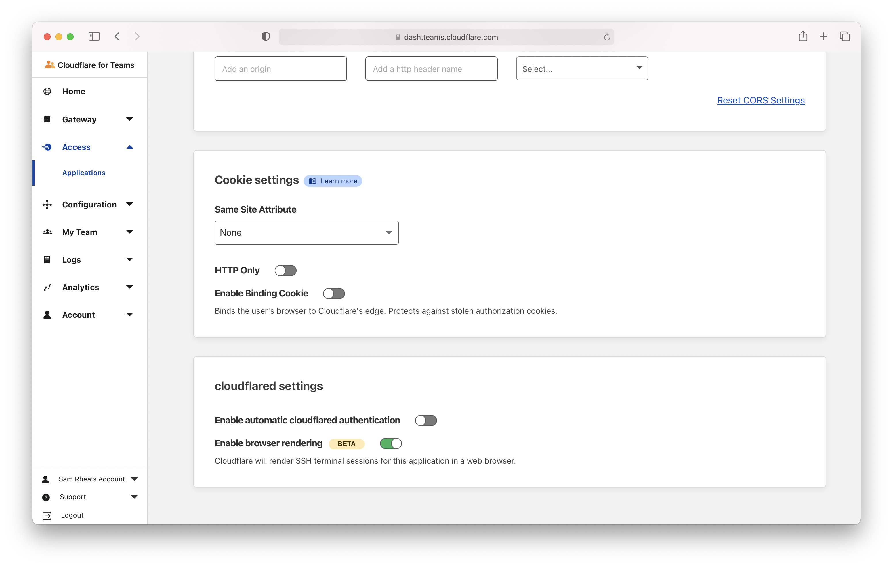
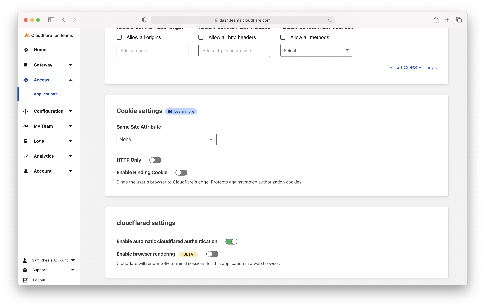

# Non-HTTP applications

You can connect applications to Cloudflare for Teams over a number of different protocols.

* [Connect through Acccss using a CLI](/tutorials/cli)
* [Connect through Access over RDP](/tutorials/rdp)
* [Connect through Access over SSH](/tutorials/ssh)
* [Connect through Access using kubectl](/tutorials/kubectl)
* [Connect through Access over SMB](/tutorials/smb)

## Rendering in the browser

Cloudflare can render certain non-web applications in your browser without the need for client software or end user configuration changes. Cloudflare currently supports rendering a terminal for SSH connections in a user's browser.

To enable, follow the instructions [here](/tutorials/ssh) to connect a machine available over SSH to Cloudflare. Next, navigate to the application page of the Access section in the Cloudflare for Teams dashboard. Click **Edit** and select the Settings tab. In the `cloudflared settings` card, toggle `Enable browser rendering` to on.

Once enabled, when users authenticate and visit the URL of the application, Cloudflare will render a terminal in their browser.

## Automatic `cloudflared` authentication

<Aside>

This should only be enabled if a [service token](/identity/service-auth/service-tokens) cannot be used for your automated service.

</Aside>

<TableWrap>

| Before you start |
| ------------------- |
| Ensure you have an automated service relying on `cloudflared` authentication |
| Ensure you have an active IdP session when logging in through `cloudflared` |

</TableWrap>

When you log into Access through `cloudflared`, your browser prompts you to allow access by 
displaying this page:

To avoid seeing this page every time you authenticate through `cloudflared`, navigate to the application page of the Access section in the Cloudflare for Teams dashboard. Click **Edit** and select the Settings tab. In the `cloudflared settings` card, toggle `Enable automatic cloudflared authentication` to on.

This option will still prompt a browser window in the background, but the authentication will be automatic.