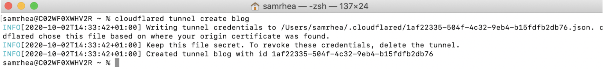

# Create a Tunnel

| Before you start |
|---|
| 1. [Add a website to Cloudflare](https://support.cloudflare.com/hc/en-us/articles/201720164-Creating-a-Cloudflare-account-and-adding-a-website) |
| 2. [Change your domain nameservers to Cloudflare](https://support.cloudflare.com/hc/en-us/articles/205195708) |
| 3. [Install and authenticate `cloudflared`](/connections/connect-apps/install-and-setup) |

## Create a Tunnel

To create a Tunnel, run the following command:

```sh
$ cloudflared tunnel create <NAME>
```

Replace `<NAME>` with the name you want to give to the Tunnel. The name assigned can be any string and does not need to relate to the hostname where traffic will be served.

This command will create a Tunnel with the name provided and associate it with a UUID. The relationship between the UUID and the name is persistent. The command will not create a connection at this point.

The created Tunnel can serve traffic for multiple hostnames in your Cloudflare account and send traffic to multiple services available to `cloudflared`, including SSH, RDP, and most arbitrary TCP connections.



Creating a Tunnel generates a credentials file for that specific Tunnel. This file is distinct from the cert.pem file. To run the Tunnel without managing DNS from `cloudflared`, you only need the credentials file.

<TableWrap>

| Action | `cert.pem` | Credentials file |
|---|---|---|
| Create a new Tunnel | Required | - |
| Delete a Tunnel | Required | - |
| Run a Tunnel | Available | Required |
| Create DNS records<br/>from `cloudflared` | Required | - |
| Connect to load balancer<br/>pools from `cloudflared` | Required | - |
| Route traffic to a running Tunnel<br/>from the Cloudflare dashboard | Available | Available |

</TableWrap>

## List available Tunnels

`cloudflared` can list all created Tunnels in your account, as well as those actively connected to Cloudflare, by running the following command:

```sh
$ cloudflared tunnel list
```

Note: the command requires the `cert.pem` file.


## Revoke and delete a Tunnel

You can delete an existing Tunnel with cloudflared. To delete a Tunnel, run the following command:

```sh
$ cloudflared tunnel delete <NAME>
```
<Aside>

The command requires the `cert.pem` file.

</Aside>

If there are still active connections on that Tunnel, then you will have to force the deletion with:

```sh
$ cloudflared tunnel delete -f <NAME>
```

This will cause those connections to be dropped.

Deleting the Tunnel also invalidates the credentials file associated with that Tunnel, meaning those connections can not be re-established.

<Aside>

Tunnels created in this method do not currently display in the **Traffic** tab of the [Cloudflare dashboard](https://dash.cloudflare.com). These connections will be added to the dashboard in a future release.

</Aside>
