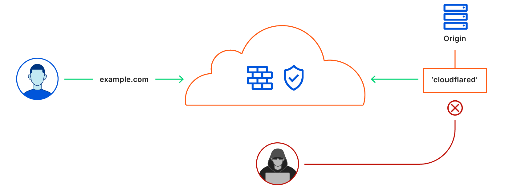

# Connect applications

You can connect applications, servers, and other resources to Cloudflare's network using [Argo Tunnel](/glossary#argo-tunnel). When connected, Cloudflare can apply [Zero Trust policies](/policies/zero-trust) to determine who can reach the resource.

Argo Tunnel runs a lightweight [daemon](/glossary#daemon) ([`cloudflared`](/glossary#cloudflared)) in your infrastructure that establishes outbound connections (Tunnels) between your web server and the Cloudflare edge. When Cloudflare receives a request for your chosen hostname, it proxies the request through those connections to `cloudflared`. In turn, `cloudflared` proxies the request to your applications.

This forces any requests to access your applications to go through Cloudflare. This way, you can be sure attack traffic is stopped with Cloudflare’s WAF and Unmetered DDoS mitigation, and authenticated with Access if you’ve enabled those features for your account. 

In order to create and manage Tunnels, you'll first need to:

1. [Download and install `cloudflared`](/connections/connect-apps/install-and-setup/installation) on your machine
2. [Authenticate `cloudflared`](/connections/connect-apps/install-and-setup/setup)

Once `cloudflared` has been installed and authenticated, the process to get your first Tunnel up and running includes 3 high-level steps:

1. [Creating a Named Tunnel](/connections/connect-apps/create-tunnel)
2. [Routing traffic to your Tunnel](/connections/connect-apps/routing-to-tunnel)
3. [Running your Tunnel](/connections/connect-apps/run-tunnel)

Steps 1-2 are executed once per Tunnel, normally by an administrator, and Step 3 is executed whenever the Tunnel is to be started, normally by the owner of the Tunnel (whom may be different from the administrator).

Be sure to check out our [Tutorials](/tutorials), where you can also find
best practices for managing Tunnels as an administrator.