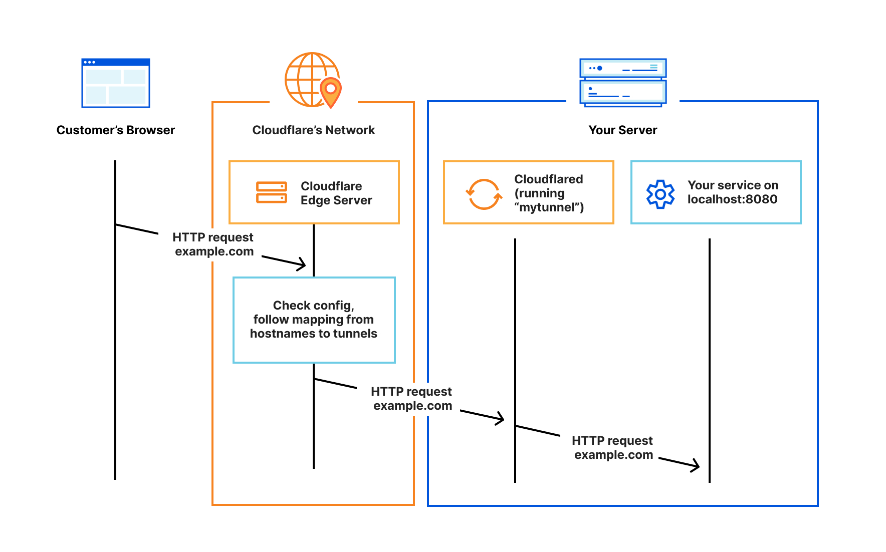
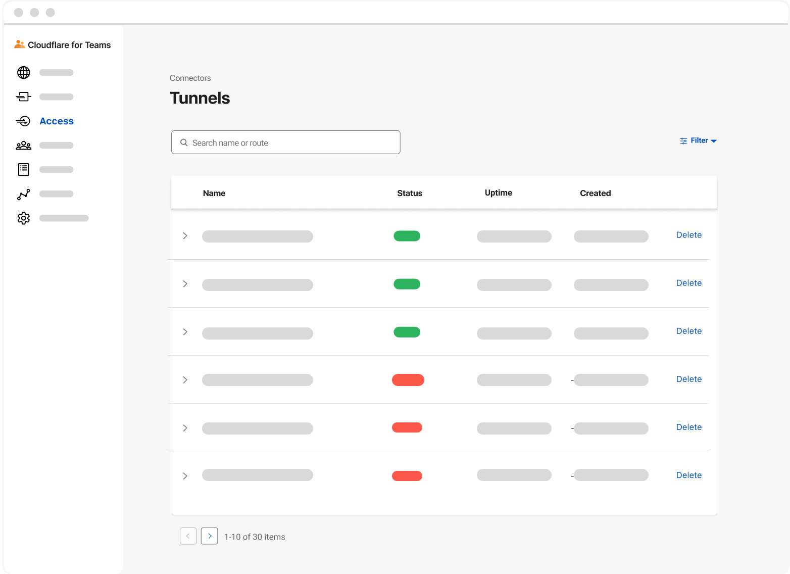

# Connect resources

Cloudflare Tunnel provides you with a secure way to connect your resources to Cloudflare without a publicly routable IP address. With Tunnel, you do not send traffic to an external IP — instead, a lightweight daemon in your infrastructure (`cloudflared`) creates outbound-only connections to Cloudflare’s edge. Cloudflare Tunnel can connect HTTP web servers, [SSH servers](/tutorials/ssh), [remote desktops](/tutorials/rdp), and other protocols safely to Cloudflare. This way, your origins can serve traffic through Cloudflare without being vulnerable to attacks that bypass Cloudflare.

## How it works

Cloudflared establishes outbound connections (tunnels) between your resources and the Cloudflare edge. Tunnels are persistent objects that route traffic to DNS records. Within the same tunnel, you can run as many `cloudflared` processes (connectors) as needed. These processes will establish connections to the Cloudflare edge and send traffic to the nearest Cloudflare data center.

## Working with Cloudflare Tunnel

Most interactions with Cloudflare Tunnel require the use of a CLI — for example, to create and configure tunnels, and to run a tunnel or route traffic through it. To get started, visit the Cloudflare for Teams Dashboard and navigate to Access. Under Access, you’ll find a home for Tunnels. When visiting the page for the first time, you will find a step-by-step tutorial outlining how to create your first tunnel.

Once your first tunnel is connected to Cloudflare, you’ll be able to use this page to check your tunnel status, as well as view a comprehensive list of active or inactive tunnels. 

## Getting started

Follow our [step-by-step guide](/connections/connect-apps/install-and-setup/tunnel-guide) on how to get your first tunnel up and running. The guide covers how to download, install and authenticate `cloudflared`, create your first tunnel, route traffic through it, and ultimately run your tunnel.

You can familiarize yourself with Cloudflare Tunnel concepts and terminology by checking out the [Useful Terms page](/connections/connect-apps/install-and-setup/tunnel-useful-terms). For a list of common tunnel commands, refer to the [Useful Commands page](/connections/connect-apps/install-and-setup/tunnel-useful-commands).
