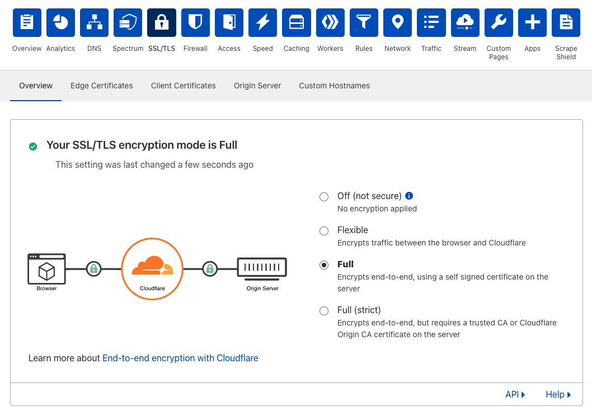

# Troubleshooting

## Check SSL/TLS encryption mode
1. On the Cloudflare dashboard for your zone, navigate to **SSL/TLS** > **Overview**.
1. If your SSL/TLS encryption mode is **Off (not secure)**, make sure that it is set to **Flexible**, **Full** or **Full (strict)**.



When the encryption mode is set to **Off (not secure)**, you may encounter connection issues when running a Tunnel.

--------

## Check location of credentials file
If you encouter the following error when running a Tunnel, double check your `config.yml` file and ensure that the `credentials-file` points to the correct location. You may need to change `/root/` to your home directory.
```sh
$ cloudflared tunnel run
2021-06-04T06:21:16Z INF Starting tunnel tunnelID=928655cc-7f95-43f2-8539-2aba6cf3592d
Tunnel credentials file '/root/.cloudflared/928655cc-7f95-43f2-8539-2aba6cf3592d.json' doesn't exist or is not a file
```

--------

## Run Tunnel with debug logging

Use the following command to run your Tunnel in the debug mode:
```sh
$ cloudflared tunnel --loglevel debug run
```

The `--loglevel` flag indicates the logging level, which can be one of {`debug`, `info`, `warn`, `error`, `fatal`} (default: `info`). At the `debug` level, `cloudflared` will log and display the request URL, method, protocol, content length, as well as all request and response headers. However, please note that this can expose sensitive information in your logs. 
