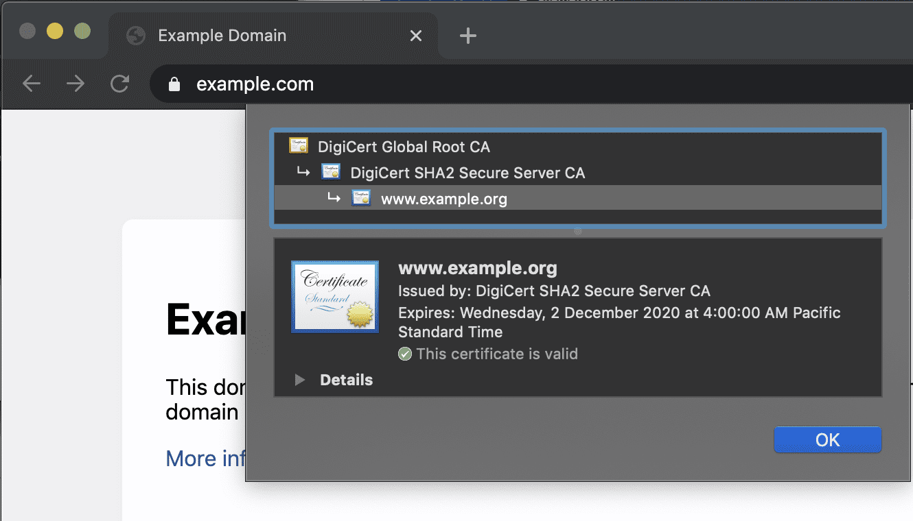
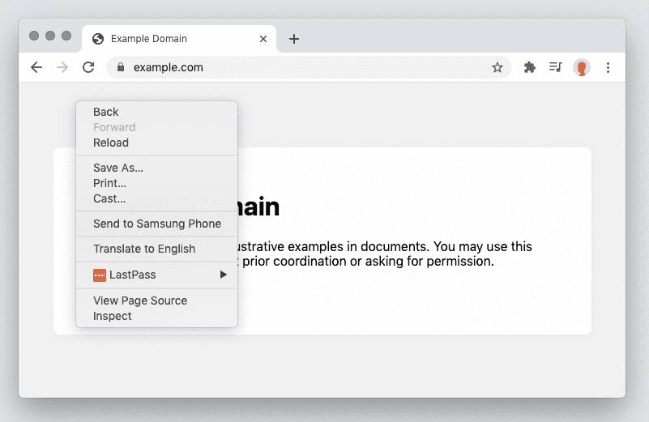
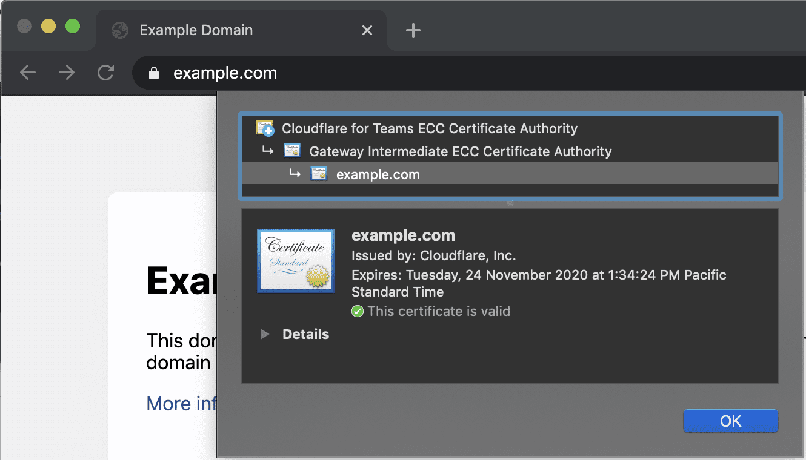
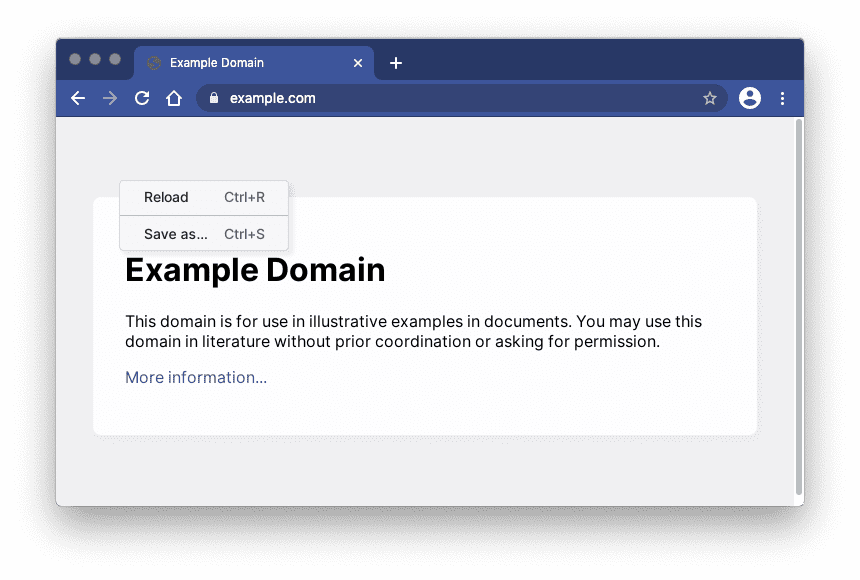

---
order: 1
--- 

# Setup

Browser Isolation is enabled through Secure Web Gateway HTTP policies. By default, no traffic is isolated until an Isolation policy has been added within HTTP policies. To start isolating your traffic, you need to:

1. Create a [Cloudflare for Teams account](https://dash.teams.cloudflare.com/) and select Browser Isolation as an add-on to either your Teams Standard or your Teams Enterprise plan.

1. Download the latest version of the [WARP client](/connections/connect-devices/warp/download-warp).

1. Create a [Device enrollment policy](/connections/connect-devices/warp/device-enrollment).

1. Set up an [Isolation policy](/policies/filtering/http-policies/#isolate).

Cloudflare Browser Isolation integrates with your existing web browser. Once connected to Cloudflare WARP, open your browser and navigate to any websites you normally use.

Every tab is automatically connected to an isolated browser running on Cloudflare's edge.

## How to check if a webpage is isolated

The easiest way to check if a webpage is proxied through Cloudflare is by checking for the presence of a Cloudflare Root CA.

In Chrome, click the padlock to the left of your address bar and select **Certificate**.

### Normal Browsing

**Non-Cloudflare Root CA**. Non-Cloudflare for Teams root certificate indicates that Cloudflare did not proxy this webpage.

**Normal context menu**. Right-click context menu will have all normal options.

### Isolated Browsing

**Cloudflare Root CA**. Cloudflare for Teams + Gateway Intermediate indicates traffic was proxied through Cloudflare Gateway.

**Simplified context menu**. Right-click context menu be simplified. 

## Disconnecting Browser Isolation

If you would like to temporarily disconnect Browser Isolation, you can do this by simply selecting the WARP agent and disconnecting the client.

### macOS
1. Click on the Cloudflare Logo in the Menu Bar.
1. Toggle the blue Connected switch into the Disconnected state.
1. Refresh your webpage to return to the non-isolated page.

### Windows

1. Click on the Cloudflare Logo in the System Tray.
1. Toggle the blue Connected switch into the Disconnected state.
1. Refresh your webpage to return to the non-isolated page.
