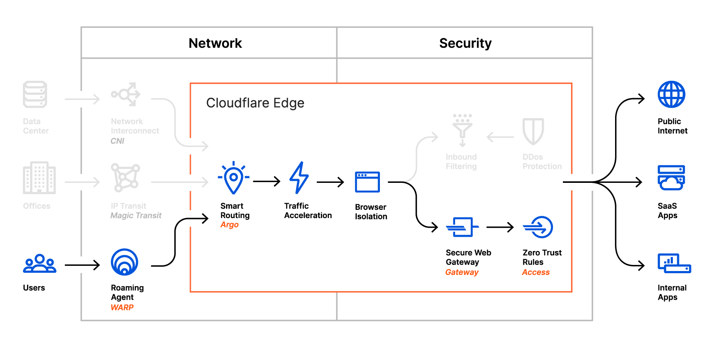

# Connect browsers

<Aside>

Browser Isolation is available as an add-on to Teams Standard and Enterprise plans. See our [payment plans](https://www.cloudflare.com/teams-pricing/) for more information.

</Aside>

Cloudflare Browser Isolation works by intercepting normal browsing traffic and serving a web-native remote client to the user's browser, instead of the normal HTML/CSS/Javascript content. Since this content is not served to the user's browser, it is protected from malicious websites that attempt to exploit web-based vulnerabilities.

Remote browsing is invisible to the user who continues to use their browser normally without changing their preferred browser and habits. Every open tab and window is automatically isolated.

Browser Isolation is integrated into Cloudflare for Teams [HTTP Policies](/policies/filtering/http-policies).

To start protecting your users through remote browsing, you need:

* A Cloudflare for Teams Standard or Enterprise plan, and a Browser Isolation add-on subscription
* The [WARP client](/connections/connect-devices/warp) installed on your devices

## Privacy

Cloudflare Browser Isolation is a security product. In order to serve transparent isolated browsing and block web based threats our network decrypts Internet traffic using the [Cloudflare Root CA](/connections/connect-devices/warp/install-cloudflare-cert). Traffic logs are retained as per the [Gateway Logs](/analytics/gateway) documentation.