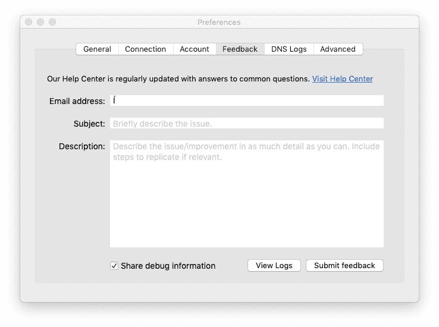

# Known limitations

## Webpage compatibility

Our Network Vector Rendering (NVR) technology allows us to deliver a secure remote computing experience without the bandwidth limitations of video streams. While we expect most websites to work perfectly, some browser features and web technologies are unsupported and will be implemented in future:

- Webcam / Microphone support is unavailable.
- Websites that use WebGL may not function.
- Netflix and Spotify Web Player are unavailable.

If one of these limitations affects you, please let us know by [submitting feedback](#submitting-feedback).

## Device / Browser support

- Modern Chromium, Google Chrome, Mozilla Firefox, Safari, Edge (Chromium) and Opera are supported.
- Internet Explorer 11 and below is unsupported.
- Brave Browser requires Site Shield and Cookie blocking to be disabled.

### Browser dependencies

We are still defining our minimum requirements but expect Browser Isolation to work on most modern web browsers. Under the hood the browser needs to support:

- [WebAssembly](https://caniuse.com/?search=wasm)
- [WebRTC](https://caniuse.com/?search=webrtc)
- [LocalStorage](https://caniuse.com/?search=localstorage)

### Safari

Safari's default configuration is susceptible to "[Maximum Sessions Reached](/faq/teams-troubleshooting#i-see-a-maximum-sessions-reached-alert)" alerts. To workaround this behaviour open Safari → Preferences → Privacy and uncheck **Prevent cross-site tracking**.

## Submitting feedback

Please submit feedback by opening Cloudflare WARP and selecting the Bug Icon.

This will open the Feedback window for you to submit feedback. If we require further information we may contact you via the supplied email address.

