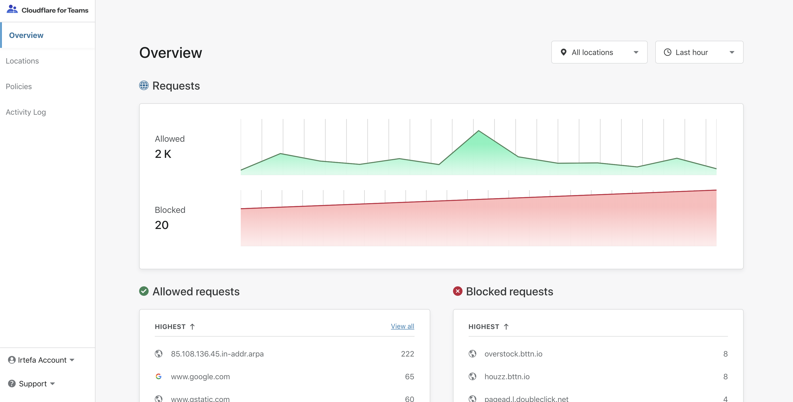
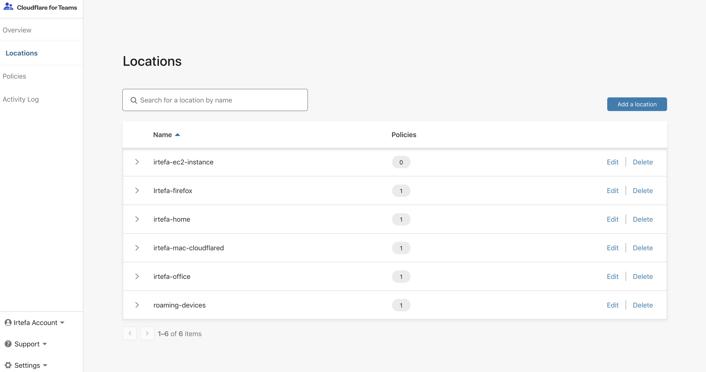
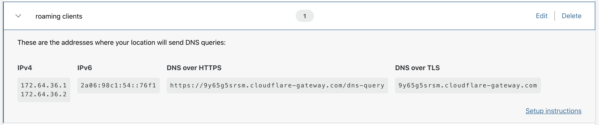
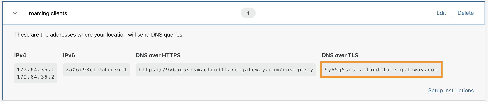

# DNS over TLS

By default, DNS is sent over a plaintext connection. DNS over TLS (DoT) is a standard for encrypting DNS queries to keep them secure and private. DoT uses the same security protocol, TLS, that HTTPS websites use to encrypt and authenticate communications.

Cloudflare supports DoT on standard port `853` and is compliant with [RFC7858](https://tools.ietf.org/html/rfc7858).

## Configuration

### Obtain your DoT hostname

Each Gateway location has a unique DoT hostname. Locations and corresponding DoT hostnames have policies associated with them.

1. Visit your [Teams dashboard](https://dash.teams.cloudflare.com/).
1. Navigate to the **Locations** page to visualize your location.

 

1. If you have more than one location set up, you will see a list of all your locations.

 

3. Expand the location card for the location whose DoT hostname you'd like to retrieve.

 

4. Get the **DoT hostname** for the location.
 
 In the example below, the DoT hostname is: `9y65g5srsm.cloudflare-gateway.com`.

 

5. Take note of the **DoT hostname**.

### Configure your DoT client

Depending on your operating system, you can choose from a variety of standalone DoT clients. 

To configure your DoT client, use the following IP address and hostname:

```text
Hostname: DoT hostname for a chosen location (above this is 9y65g5srsm.cloudflare-gateway.com)
IP address: 162.159.36.5
```

Alternatively, stub resolvers (e.g., Unbound) support DoT natively. 

```text
# Unbound TLS Config
tls-cert-bundle: "/etc/ssl/cert.pem"
# Forwarding Config
forward-zone:
	name: "."
	forward-tls-upstream: yes
	forward-addr: 172.64.36.1@853#xxxxxxxxx.cloudflare-gateway.com
	forward-addr: 172.64.36.2@853#xxxxxxxxx.cloudflare-gateway.com
	forward-addr: 2a06:98c1:54::xxxx#xxxxxxxxx.cloudflare-gateway.com
 ```
 
 <Aside>
 
Each location has a unique DoT hostname and IPv6 address. Remember to enter your location's values when applying the config above.

</Aside>

## Supported TLS versions

Cloudflare's DNS over TLS supports TLS 1.3 and TLS 1.2.
