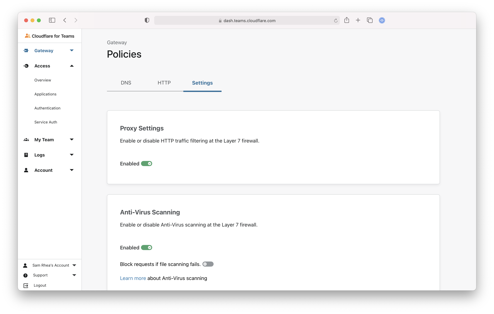

# Control proxy settings

You can use the Cloudflare for Teams dashboard to control the proxy settings of your deployment.

## Enable the proxy

Once devices have enrolled in your account, via user action or administrator deployment, you must enable the proxy to begin inspecting HTTP traffic.

<Aside>

Ensure the Cloudflare root certificate has been installed first to avoid breaking user Internet connections.

</Aside>

Navigate to the **Settings** tab of the `Policies` page in the Gateway section of the Cloudflare for Teams dashboard. Toggle the `Proxy Settings` value to be "Enabled".

