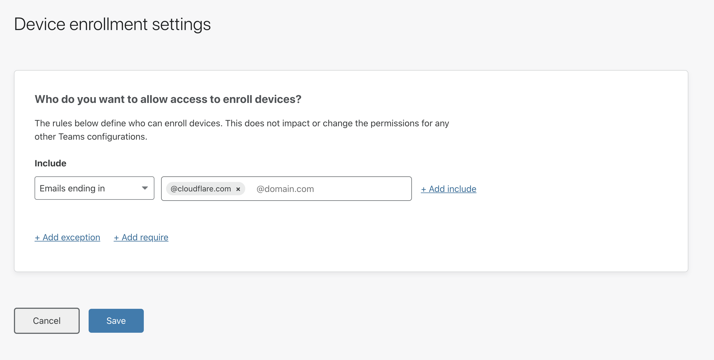

# Device enrollment policies

<Aside>

Revoking a user's permission to manage devices will not prevent that user from authenticating to applications. If you wish to revoke access to that user, you can do so by [revoking their user session](/identity/users/session-management#revoke-user-sessions). 

</Aside>

Cloudflare for Teams allows you to establish which users in your organization can enroll new devices or revoke access to connected devices. To do that, you can create a **device enrollment rule** on the Teams dashboard.

1. On the [Teams dashboard](https://dash.teams.cloudflare.com), navigate to **Devices**.

2. Click **Device Settings** on the top-right corner.

3. In the rule builder, configure a rule to define who can enroll or revoke devices. 
 In this example, only users with `cloudflare.com` email addresses who successfully authenticate during device enrollment through the WARP client will be able to enroll in the organization. This rule prevents outsider users from sending traffic through your account and will give your organization the ability to capture user profile logs and apply profile-specific rules.

  

4. Click **Save**.