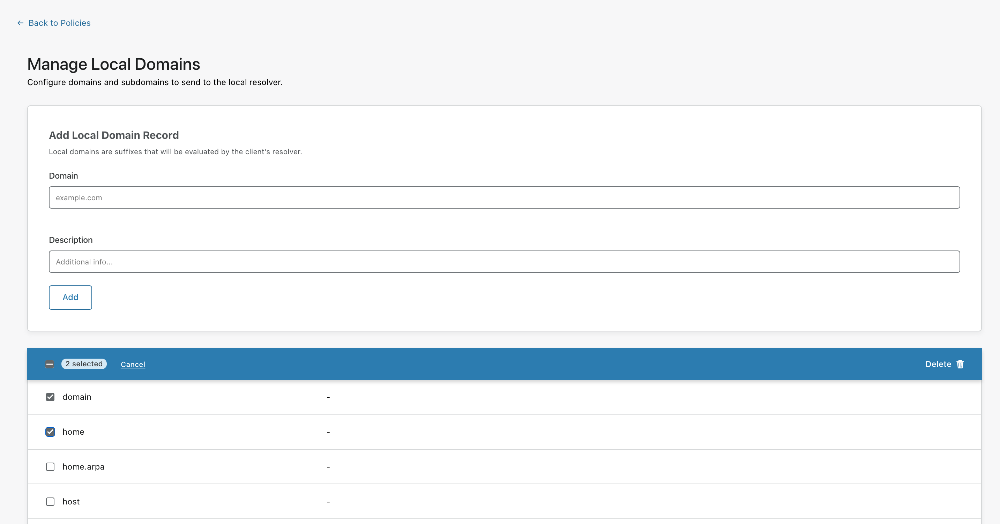

 
# Local Domain Fallback
 
 <Aside>
 
In order for the WARP client to pick up any changes you make to Split Tunnels or Local Domain Fallback, you will need to restart it. To do that, you can either restart the computer or quit the application and relaunch it. This behavior will be improved in a future release.
 
</Aside>

By default, Cloudflare for Teams excludes common top level domains used for local resolution from being sent to the Cloudflare proxy. Excluded domains are listed on the Teams dashboard under **Gateway** > **Policies** > **Settings** > **Local Domains - WARP**. All domains in that list rely on the local DNS resolver configured for the device.
 
You can add or remove domains from the Local Domains list at any time.

1. On the Teams dashboard, navigate to **Policies** > **Settings**.
 

 
1. Click **Manage Local Domains**.
 

 
1. On this page, you'll find a list of domains Cloudflare for Teams excludes. You can customize this list to add or remove any items from it.
 

 
## Add a domain
 
On the Manage Local Domains page, in the **Add Local Domain Record** card, enter the domain and an optional description in the relevant fields.  Then, click **Add**.
 
The domain will appear in the list below.
 
 
 
## Delete a domain
 
To remove a domain from the list, locate the domain and then click **Delete**.
 
If you wish to remove multiple domains at the same time, click the checkbox to the left of each domain to select it, and click **Delete** in the top right corner of the box.

 
